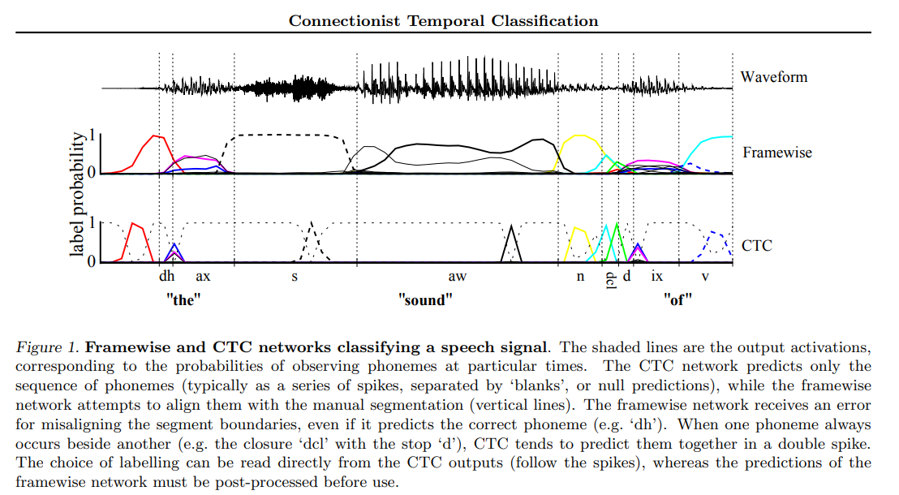

# 📖 PAPER READING NOTES — CTC Loss (Graves et al., ICML 2006)

> File **đọc + ghi chú** riêng rút ra từ Phần B của `PLAN.md`. Đọc theo thứ tự **B1 → B13** (không theo thứ tự trang).
> Cách dùng: tick checkbox `- [ ]` khi đọc xong phần đó → viết thẳng vào ô **✍️ Ghi chú của tôi**.
>
> **Màu theo phase:** 🟨 Context (B1–B3) · 🟥 Core technical (B4–B5) · 🟦 So sánh & bối cảnh (B6–B9) · 🟩 Bằng chứng & tổng hợp (B10–B13)
>
> **Quy ước trong từng mục:**
> - 🔢 **Key point đánh số** — badge nền cam `#FFE0B2` — diễn giải của tôi, không có trong paper; mọi bullet dưới **Key points:** cũng được tô cam.
> - 🟣 Khối `📜 PAPER · <vị trí>` — **trích dẫn nguyên văn** từ paper, kèm trang; đặt **ngay dưới key point mà nó chứng minh**.
> - `↳` dòng xám — giải nghĩa quote liên hệ về key point.
>
> ⚠️ *Highlight màu dùng inline HTML — hiện đầy đủ trong VS Code preview / Typora / Obsidian. Trên GitHub, style bị strip nhưng heading vẫn hiện text + emoji màu.*

---

## 📌 Bảng phủ paper (tick ☐ → ☑ khi đọc xong để không bị sót)

Paper 8 trang. Đọc **theo thứ tự B1→B13** (không theo thứ tự trang), dùng bảng này để đối chiếu phần nào của paper đã đi qua:

| ✓ | Mục paper (trang) | Nội dung chính | Mục B tương ứng |
|---|---|---|---|
| ☐ | Abstract (tr.1) | Tóm tắt: bài toán + phương pháp + kết quả TIMIT | B1 |
| ☐ | §1 Introduction (tr.1–2) | Nhược điểm HMM/CRF (3 điểm), hybrid HMM-RNN, ý tưởng CTC, temporal vs framewise | B2, B6 |
| ☐ | §2 Temporal Classification (tr.2) | Formalism: X, Z, điều kiện U ≤ T, temporal classifier `h` | B4 |
| ☐ | §2.1 Label Error Rate + eq(1) (tr.2) | LER = edit distance chuẩn hóa | B10 |
| ☐ | §3.1 + eq(2)(3) (tr.2–3) | Softmax `\|L\|+1` units (⚠️ không đánh số), blank, path π, **eq(2) tích path**, giả định independence, map B, eq(3) `p(l\|x)` | B3, B4, B5, B8 |
| ☐ | Fig 1 (tr.3) | Framewise vs CTC: spike vs align với segmentation | B2, B3 |
| ☐ | §3.2 + eq(4) (tr.3) | Decoding: best path, prefix search (Fig 2), heuristic chia section theo blank | B4, B9 |
| ☐ | §4 intro (tr.4) | Principle of maximum likelihood, BPTT | B5 |
| ☐ | §4.1 + eq(5)–(8) (tr.4–5) | Forward: biến `l′` chèn blank, α, skip rule, `p(l\|x) = αT(\|l′\|) + αT(\|l′\|−1)` | B4, B12 |
| ☐ | §4.1 + eq(9)–(11) (tr.5) | Backward β, điều kiện biên | B4 |
| ☐ | §4.1 rescaling `C_t`, `D_t` (tr.5) | Chống underflow; `ln p(l\|x) = Σ ln C_t` | B4 |
| ☐ | §4.2 + eq(12)–(14) (tr.5–6) | Objective `O_ML`, vai trò `α_t(s)β_t(s) / y_t^{l′_s}` | B4, B5 |
| ☐ | §4.2 + eq(15)–(16) (tr.6) | Gradient theo `y^t_k` và `u^t_k` (error signal) | B4 |
| ☐ | Fig 3 (tr.5) / Fig 2 (tr.4) / Fig 4 (tr.6) | Lattice "CAT" / prefix search tree / evolution of error signal | B4, B12 |
| ☐ | §5 intro (tr.6) | Thiết kế thí nghiệm: CTC vs HMM vs hybrid, chọn BLSTM | B7, B8 |
| ☐ | §5.1 Data (tr.6) | TIMIT, 61 phonemes, MFCC, chuẩn hóa | B10 |
| ☐ | §5.2 Setup (tr.7) | Chi tiết BLSTM + hyperparams, noise σ=0.6, baseline HMM/hybrid | B8, B9, B10 |
| ☐ | Table 1 + §5.3 Results (tr.7) | Bảng LER, phân tích significance | B7, B10 |
| ☐ | §6 Discussion (tr.7–8) | Không explicit segment, inter-label deps, hierarchical CTC, overfitting | B5, B7, B9, B11, B13 |
| ☐ | §7 Conclusions (tr.8) | Tóm tắt đóng góp | B13 |
| ☐ | References (tr.8) | Rabiner 89, Bourlard & Morgan 94, Hochreiter 97, Schuster & Paliwal 97… | B6 |

> eq(14) nằm trong B4 (dẫn tới eq 15); Acknowledgements bỏ qua. Hết bảng = hết paper.

---

<h3>🟨 <span style="background-color:#FFF3CD; color:#856404; padding:3px 12px; border-radius:6px; border:1px solid #FFEEBA">B1 · BIG PICTURE</span> <span style="color:#888; font-size:0.85em">— Đọc: Abstract (tr.1)</span></h3>

**Checklist đọc:**
- [ ] Abstract (tr.1) — chỉ 1 đoạn, đọc chậm từng câu

**Key points:**

<span style="background-color:#FFE0B2; color:#E65100; padding:1px 8px; border-radius:4px; border:1px solid #FFB74D; font-weight:bold">1️⃣ CTC = huấn luyện RNN gán nhãn chuỗi không cần pre-segmented data, mọi thứ trong 1 kiến trúc.</span>

> 📜 <span style="background-color:#EDE7F6; color:#5E35B1; padding:2px 8px; border-radius:4px; font-weight:bold">PAPER · Abstract (tr.1) — câu kết Abstract</span>
>
> *"This paper presents a novel method for training RNNs to label unsegmented sequences directly, thereby solving both problems."*
>
> <span style="color:#777">↳ "both problems" = 2 vấn đề nêu ngay câu trước đó: pre-segmented training data + post-processing output.</span>

> 📜 <span style="background-color:#EDE7F6; color:#5E35B1; padding:2px 8px; border-radius:4px; font-weight:bold">PAPER · §1 (tr.2, đoạn cuối cột phải) — câu mở đầu đoạn</span>
>
> *"This paper presents a novel method for labelling sequence data with RNNs that removes the need for pre-segmented training data and post-processed outputs, and models all aspects of the sequence within a single network architecture."*
>
> <span style="color:#777">↳ nguồn của ý "mọi thứ trong 1 kiến trúc".</span>

<span style="background-color:#FFE0B2; color:#E65100; padding:1px 8px; border-radius:4px; border:1px solid #FFB74D; font-weight:bold">2️⃣ Alignment được gộp vào trong network — không phải HMM align hộ từ bên ngoài.</span>

> 📜 <span style="background-color:#EDE7F6; color:#5E35B1; padding:2px 8px; border-radius:4px; font-weight:bold">PAPER · §1 (tr.2, cùng đoạn) — câu "basic idea"</span>
>
> *"The basic idea is to interpret the network outputs as a probability distribution over all possible label sequences, conditioned on a given input sequence."*
>
> <span style="color:#777">↳ alignment được marginalize bên trong mô hình qua phân phối xác suất — đi sâu ở §3.1 (eq 2–3), mục B4.</span>

🧭 **Trước CTC, bài toán này được xử lý thế nào?** (nền để hiểu 4️⃣)
- **Cách cũ 1 — cắt/gắn thủ công:** người gắn label cho **từng frame** rồi train framewise (chính là "Kiểu 1" ở 4️⃣ dưới).
- **Cách cũ 2 — hybrid HMM-RNN:** HMM tự align hộ + post-processing output (§1, tr.1–2 — sẽ đọc kỹ ở B2).
- **CTC:** bỏ cả hai — network **tự học alignment** trong lúc train.

<span style="background-color:#FFE0B2; color:#E65100; padding:1px 8px; border-radius:4px; border:1px solid #FFB74D; font-weight:bold">3️⃣ Câu hỏi trung tâm:</span> input T time-steps, output U labels (U ≤ T), **không ai chỉ cho mình cặp nào khớp cặp nào** — học thế nào?
*(Chỉ là intuition rút ra từ Abstract, chưa cần đọc gì thêm. Bản formal hóa chính thức của câu hỏi này nằm ở §2 Temporal Classification (tr.2) — sẽ đọc kỹ ở **B4**, không phải bây giờ.)*

<span style="background-color:#FFE0B2; color:#E65100; padding:1px 8px; border-radius:4px; border:1px solid #FFB74D; font-weight:bold">4️⃣ Gắn với repo — so sánh 2 kiểu data khi train:</span>

> *Thuật ngữ: **cột = time-step**. ⚠️ Lưu ý phạm vi: **paper 2006 chỉ nói RNN**, với input **đã là chuỗi 1D** (speech frames — mỗi frame là 1 time-step). Còn repo mình dùng **CRNN (Shi et al. 2015)** — bản mở rộng **sau** paper: **CNN** phụ trách biến ảnh 2D thành chuỗi 1D (các dải dọc, imgW=100 → T=26 time-steps), phần **RNN + CTC** phía sau chạy đúng như paper. Khi giảng: nói rõ "paper = RNN + CTC; CNN chỉ là phần chuẩn bị input của mình".*

**Kiểu 1 — Có label từng cột (segmented) — cách truyền thống TRƯỚC CTC:**

```
Ảnh "AB" (7 cột minh họa):
 ┌───┬───┬───┬───┬───┬───┬───┐
 │ A │ A │ A │ · │ B │ B │ B │  ← nội dung ảnh từng dải dọc (· = nền trống)
 ├───┼───┼───┼───┼───┼───┼───┤
 │ A │ A │ A │ – │ B │ B │ B │  ← label ĐÃ CÓ SẴN cho từng cột
 └───┴───┴───┴───┴───┴───┴───┘
Mỗi cột có đáp án riêng ⇒ train framewise: softmax + CE từng cột.
```

**Kiểu 2 — Chỉ có chuỗi cuối (unsegmented) → PHẢI dùng CTC:**

```
Captcha "2B2847" (25 cột, rút gọn):
 ┌───┬───┬───┬───┬───┬───┬─ … ─┐
 │ ? │ 2 │ ? │ ? │ B │ ? │  7  │  ← model có thể đoán, nhưng KHÔNG có đáp án đúng/sai từng cột
 └───┴───┴───┴───┴───┴───┴─ … ─┘
             ↓ thứ duy nhất biết được ↓
      label = "2B2847"   (6 ký tự, KHÔNG kèm vị trí)
Ngoài ra chữ/số nét đậm nhạt, dính nhau… ⇒ càng không thể gắn cột thủ công.
⇒ CTC: thử MỌI cách ghép 25 cột → "2B2847", cộng xác suất tất cả (mục B4).
```

→ Captcha trong repo thuộc kiểu 2 ⇒ đây chính là temporal classification (§2), lý do tồn tại của CTC loss.

> [!TIP]
> Sau khi đọc xong Abstract, thử **tự trả lời trước khi đọc tiếp**: "Nếu tôi phải train mạng mà không biết mỗi frame thuộc chữ nào, tôi làm sao?"

**✍️ Ghi chú của tôi:**

&nbsp;

---

<h3>🟨 <span style="background-color:#FFF3CD; color:#856404; padding:3px 12px; border-radius:6px; border:1px solid #FFEEBA">B2 · MOTIVATION</span> <span style="color:#888; font-size:0.85em">— Đọc: §1 Introduction (tr.1–2) + Fig 1 (tr.3)</span></h3>

**Checklist đọc:**
- [ ] Xem **Fig 1** trước (tr.3) — có hình ảnh trực quan rồi mới đọc §1 dễ hơn
- [ ] §1 (tr.1–2): 3 nhược điểm HMM/CRF, giới hạn framewise RNN, hybrid HMM-RNN

**Key points:**

🧭 **Mạch của §1** (giữ mạch này khi giảng): HMM/CRF chủ đạo nhưng có 3 nhược điểm (1️⃣) → RNN khắc phục được cả 3 (2️⃣) → mà RNN lại không dùng trực tiếp được (3️⃣) → workaround hybrid cũng chưa ổn (4️⃣) → Fig 1 trực quan hóa vấn đề (5️⃣). **CTC = lời giải cho đúng mạch này.**

<span style="background-color:#FFE0B2; color:#E65100; padding:1px 8px; border-radius:4px; border:1px solid #FFB74D; font-weight:bold">1️⃣ Trước CTC: HMM/CRF là framework chủ đạo cho sequence labelling — nhưng có 3 nhược điểm.</span>

> 📜 <span style="background-color:#EDE7F6; color:#5E35B1; padding:2px 8px; border-radius:4px; font-weight:bold">PAPER · §1 (tr.1, cột phải)</span>
>
> *"While these approaches have proved successful for many problems, they have several drawbacks: (1) they usually require a significant amount of task specific knowledge, e.g. to design the state models for HMMs, or choose the input features for CRFs; (2) they require explicit (and often questionable) dependency assumptions to make inference tractable, e.g. the assumption that observations are independent for HMMs; (3) for standard HMMs, training is generative, even though sequence labelling is discriminative."*
>
> <span style="color:#777">↳ nhược điểm (3) buồn cười nhất: bài toán là discriminative mà HMM lại train generative — "xài sai công cụ".</span>

**🔎 Ví dụ cụ thể — nhận dạng chữ viết tay "hello":**

**Bài toán thật (discriminative):** nhìn ảnh chữ `hello` → gán nhãn trực tiếp: "đây là h-e-l-l-o". Ta chỉ cần **phân biệt đúng**, không cần biết chữ "h" được *tạo ra* như thế nào.

**Nhưng HMM train kiểu generative:** nó học ngược lại — mô hình hóa "chữ *h* trông ra sao", "chữ *e* trông ra sao" (tức P(ảnh | chữ)), rồi dùng Bayes đoán ngược. Với sequence labelling, đây là đường vòng không cần thiết.

| # | Nhược điểm | Trong ví dụ |
|---|-----------|-------------|
| (1) | Cần nhiều knowledge thủ công | Phải tự thiết kế: mỗi ký tự = state nào, bao nhiêu state cho "h", thêm gì cho khoảng trắng... |
| (2) | Giả định phụ thuộc đáng ngờ | HMM giả định ảnh từng ký tự **độc lập** — nhưng viết tay, chữ "r" đứng cạnh "n" có thể nhoè thành "m"! |
| (3) | "Xài sai công cụ" 😄 | Bài toán là *phân loại* (discriminative) mà HMM lại *học sinh ra dữ liệu* (generative) — giống như để học **phân biệt mèo vs chó**, bạn đi học **vẽ toàn bộ giống mèo và chó** trước, rồi mới dựa vào đó đoán. |

**↳ CRNN sau này giải quyết gọn:** CNN trích đặc trưng + RNN nắm ngữ cảnh (không cần giả định độc lập) + CTC train **end-to-end discriminative** — không thiết kế tay, không đường vòng.

<span style="background-color:#FFE0B2; color:#E65100; padding:1px 8px; border-radius:4px; border:1px solid #FFB74D; font-weight:bold">2️⃣ RNN khắc phục được cả 3 nhược điểm đó.</span>

> 📜 <span style="background-color:#EDE7F6; color:#5E35B1; padding:2px 8px; border-radius:4px; font-weight:bold">PAPER · §1 (tr.1–2, chuyển cột)</span>
>
> *"Recurrent neural networks (RNNs), on the other hand, require no prior knowledge of the data, beyond the choice of input and output representation. They can be trained discriminatively, and their internal state provides a powerful, general mechanism for modelling time series."*
>
> <span style="color:#777">↳ "on the other hand" = đối chiếu thẳng từng điểm với 1️⃣: không cần task-specific knowledge, train discriminative được.</span>

**🔎 Vì sao RNN giải quyết được cả 3 nhược điểm? — đối chiếu 1-1 (tiếp ví dụ chữ "hello"):**

| # | HMM/CRF (1️⃣) | RNN giải quyết thế nào |
|---|--------------|------------------------|
| (1) | Thiết kế state/feature thủ công | Học **end-to-end từ dữ liệu**: chỉ cần đưa chuỗi ảnh cột ký tự vào + chuỗi nhãn ra. Không phải quyết định "mỗi ký tự = mấy state" — network tự học. |
| (2) | Giả định quan sát **độc lập** | **Internal state (hidden state)** truyền dọc chuỗi → mỗi bước "nhớ" những bước trước: nhìn cột "r" mà trước đó là "n" thì biết đấy là "r" chứ không phải nửa "m". Ngữ cảnh = có sẵn, không cần giả định. |
| (3) | Train generative (đường vòng) | Loss trực tiếp P(nhãn \| ảnh) — **discriminative thuần**. Học thẳng "ảnh này là h-e-l-l-o", không học vẽ chữ. |

**↳ Tóm lại:** RNN thay "thiết kế tay + giả định + đường vòng generative" bằng **1 cơ chế duy nhất — hidden state + backprop qua thời gian (BPTT)**.

<span style="background-color:#FFE0B2; color:#E65100; padding:1px 8px; border-radius:4px; border:1px solid #FFB74D; font-weight:bold">3️⃣ Nhưng có 1 chướng ngại: objective chuẩn của NN định nghĩa per-frame → phải pre-segment + post-process.</span>

> 📜 <span style="background-color:#EDE7F6; color:#5E35B1; padding:2px 8px; border-radius:4px; font-weight:bold">PAPER · §1 (tr.2, đầu cột trái)</span>
>
> *"The problem is that the standard neural network objective functions are defined separately for each point in the training sequence; in other words, RNNs can only be trained to make a series of independent label classifications. This means that the training data must be pre-segmented, and that the network outputs must be post-processed to give the final label sequence."*
>
> <span style="color:#777">↳ đây chính là "both problems" trong Abstract đã thấy ở B1 — không phải ngẫu nhiên, §1 giải thích chi tiết 2 vấn đề đó.</span>

**🔎 Vì sao "per-frame objective" là vấn đề? — tiếp ví dụ chữ "hello":**

Muốn train chuẩn NN (cross-entropy từng bước), cần nhãn cho **TỪNG timestep** — nhưng ảnh "hello" chỉ có 5 chữ cái, trong khi RNN đọc theo ~50 cột dọc:

```
Input  : |h|h|h|e|e|l|l|l|l|o|o|   ← ~50 cột dọc (timesteps)
Cần    :  h h h h e e e l l l l o … ← 50 nhãn per-frame để tính loss
Có     :  "hello"                   ← chỉ 5 chữ cái, không có biên!
```

→ **Dataset thiếu thông tin**: ai quyết định cột nào thuộc "h", cột nào thuộc "e"? → phát sinh 2 gánh nặng thủ công ở **cả 2 đầu**:

| Vấn đề | Ở đầu nào | Cụ thể |
|--------|-----------|--------|
| **Pre-segmentation** | Trước khi train | Phải có người (hoặc HMM aligner) vẽ biên: cột 1–12 = "h", 13–20 = "e"... Tốn kém + dễ sai — biên vẽ sai thì RNN dự đoán đúng vẫn bị phạt (→ Fig 1, 5️⃣). |
| **Post-processing** | Sau khi dự đoán | RNN chỉ nhả chuỗi nhãn rời rạc `h h h e l l l l o o` → phải collapse + làm sạch bằng rule phía sau mới ra "hello". |

**↳ Mơ hồ chết người của post-processing:** `l l l l` collapse thành 1 chữ "l" hay 2 chữ "ll"? Không phân biệt được nếu thiếu **ký tự phân cách** — chính là lý do CTC sinh ra symbol **blank** (sẽ thấy ở B5/B6).

**↳ Vấn đề cốt lõi:** loss được định nghĩa per-frame nhưng nhãn thật (transcript) là **sequence-level** — sai lệch "đơn vị đo" này là lý do phải pre-segment + post-process. CTC giải quyết bằng cách đưa loss lên đúng cấp sequence.

**↳ Per-frame khác gì sequence-level? — khác nhau ở "đơn vị của nhãn":**

| | Per-frame | Sequence-level |
|---|---|---|
| Nhãn có sẵn | Mỗi timestep có 1 đáp án riêng: `h h h h e e l l l l o o` (50 nhãn cho 50 cột) | Chỉ 1 nhãn cho cả chuỗi: `"hello"` |
| Loss | Tính được ngay: so từng cột với đáp án từng cột, cộng lại | **Không tính được trực tiếp** — không biết đáp án từng cột là gì |
| Align | Có sẵn (đã gán) | Không có — phải tự suy |

*Ví dụ chấm bài nghe:* per-frame = có transcript từng giây ("giây 1–2: hel, giây 3–4: lo") → chấm từng giây. Sequence-level = chỉ có câu hoàn chỉnh "hello" → muốn chấm từng giây phải **tự đoán** giây nào thuộc chữ nào.

*Vì sao gây vấn đề:* cross-entropy định nghĩa trên cặp (dự đoán, nhãn) **cùng một vị trí**. Sequence-level thì cặp này không tồn tại → loss "khoá mép" không khớp → buộc phải **tự tạo** nhãn per-frame (= pre-segmentation) và **tự gộp** dự đoán per-frame (= post-processing). CTC xử lý bằng cách tính loss ngay ở cấp sequence, không cần align.

<span style="background-color:#FFE0B2; color:#E65100; padding:1px 8px; border-radius:4px; border:1px solid #FFB74D; font-weight:bold">4️⃣ Workaround thời điểm đó: hybrid HMM-RNN — nhưng kế thừa nhược điểm HMM.</span>

> 📜 <span style="background-color:#EDE7F6; color:#5E35B1; padding:2px 8px; border-radius:4px; font-weight:bold">PAPER · §1 (tr.1–2, cuối phần hybrid)</span>
>
> *"However, as well as inheriting the aforementioned drawbacks of HMMs, hybrid systems do not exploit the full potential of RNNs for sequence modelling."*
>
> <span style="color:#777">↳ hybrid = HMM align hộ + NN phân loại cục bộ; "aforementioned drawbacks" = đúng 3 nhược điểm ở 1️⃣. Đây là baseline mà CTC đánh bại ở §5 (B10).</span>

<span style="background-color:#FFE0B2; color:#E65100; padding:1px 8px; border-radius:4px; border:1px solid #FFB74D; font-weight:bold">5️⃣ Bằng chứng trực quan (Fig 1): framewise network bị phạt oan.</span>

> 📜 <span style="background-color:#EDE7F6; color:#5E35B1; padding:2px 8px; border-radius:4px; font-weight:bold">PAPER · Fig 1 caption (tr.3)</span>
>
> *"The framewise network receives an error for misaligning the segment boundaries, even if it predicts the correct phoneme (e.g. 'dh')."*
>
> <span style="color:#777">↳ đoán ĐÚNG phoneme vẫn bị phạt chỉ vì lệch biên segmentation — lệch biên là noise của label, không phải lỗi của model. CTC chỉ cần "spike" đúng chỗ, không cần đúng biên.</span>



**🌍 Bảng dịch caption Fig 1 — từng câu một:**

| # | Câu gốc (EN) | Dịch (VI) | 🧭 Ghi chú |
|---|--------------|-----------|------------|
| 1 | *Figure 1. Framewise and CTC networks classifying a speech signal.* | Hình 1. Mạng framewise và mạng CTC phân loại một tín hiệu âm thanh. | "classifying a speech signal" = gán nhãn phoneme cho từng thời điểm của audio. |
| 2 | *The shaded lines are the output activations, corresponding to the probabilities of observing phonemes at particular times.* | Các đường tô đậm là output activation — ứng với xác suất quan sát thấy phoneme tại từng thời điểm cụ thể. | Chính là "label probability" trên trục dọc (0–1): output sau softmax, mỗi đường màu = 1 phoneme. |
| 3 | *The CTC network predicts only the sequence of phonemes (typically as a series of spikes, separated by 'blanks', or null predictions), while the framewise network attempts to align them with the manual segmentation (vertical lines).* | Mạng CTC chỉ dự đoán **chuỗi** phoneme (thường là một loạt spike, ngăn cách bởi "blank" — dự đoán rỗng), trong khi mạng framewise cố khớp chúng với segmentation thủ công (các đường dọc). | 2 triết lý đối chọi: CTC = "nhả đúng thứ tự" / framewise = "phải đúng cả vị trí". Vertical lines = biên gắn tay (panel 1). |
| 4 | *The framewise network receives an error for misaligning the segment boundaries, even if it predicts the correct phoneme (e.g. 'dh').* | Mạng framewise nhận error vì lệch biên segmentation, ngay cả khi nó dự đoán ĐÚNG phoneme (ví dụ 'dh'). | ⭐ Câu "phạt oan" — ý chính của cả figure (chi tiết toy tính loss ở ý 2 trên đây). |
| 5 | *When one phoneme always occurs beside another (e.g. the closure 'dcl' with the stop 'd'), CTC tends to predict them together in a double spike.* | Khi một phoneme luôn xuất hiện cạnh phoneme khác (ví dụ âm đóng khí 'dcl' đi cùng âm tắc 'd'), CTC có xu hướng dự đoán chúng cùng nhau thành một spike kép. | Bằng chứng CTC học phụ thuộc giữa các nhãn ngầm định (không ai dạy) — nối tới [!TIP] phía dưới. |
| 6 | *The choice of labelling can be read directly from the CTC outputs (follow the spikes), whereas the predictions of the framewise network must be post-processed before use.* | Nhãn có thể được đọc trực tiếp từ output CTC (follow the spikes), trong khi dự đoán của framewise phải post-process trước khi dùng được. | "Choice of labelling" = chuỗi nhãn kết quả. Trả thẳng cho "both problems" mục 3️⃣: CTC bỏ được post-processing. |

**🎨 "The shaded lines" = các đường vẽ trong hình — ý nghĩa TỪNG LOẠI ĐƯỜNG:**

> 💡 "Shaded lines" là cách diễn đạt thời ~2006 = **những đường được vẽ ra** (output curves), KHÔNG phải vùng tô màu hay gạch chéo. Câu 2 của caption nói chung cho cả panel 2 lẫn panel 3 — đều là output activation sau softmax.

| Loại đường (nhìn thẳng vào hình) | Panel | Ý nghĩa | Vì sao có dạng đó |
|---|---|---|---|
| **Đường đen lởm chởm, dao động quanh 0** | 1 | Waveform = biên độ âm thanh theo thời gian | Đơn vị là **biên độ**, KHÔNG phải xác suất — nên chỉ panel này không có trục 0–1. Đoạn dày đặc = đang phát tiếng, thưa = im lặng |
| **Vạch dọc đứt quãng** chạy xuyên từ trên xuống | cả 3 | Biên segmentation **THỦ CÔNG** (TIMIT): mỗi cặp vạch ôm đúng 1 phoneme | Cả 3 panel dùng chung 1 trục thời gian nên vạch thẳng hàng từ waveform xuống CTC — đây là "đáp án" con người gắn tay, để đối chiếu output của model |
| **Đường MÀU cong bồng bềnh — gò RỘNG, MỀM** | 2 | Mỗi đường = P(1 phoneme) tại từng frame (0–1) | Train per-frame: MỌI frame trong đoạn 'aw' đều được gán nhãn 'aw' → mạng học phân phối TRẢI ĐỀU cả đoạn → ra gò rộng. Đường nào đang ôm gần 1 = phoneme đang được phát âm lúc đó |
| **Đường đen ĐỨT NÉT nằm ~1 suốt giữa hình** | 2 | Vẫn là 1 đường P(phoneme) — theo vị trí thì là 'aw' (nguyên âm dài giữa "sound") | Nhiều đường xác suất chồng nhau nên paper phân biệt bằng **màu × kiểu nét** (liền/đứt/chấm) — nét đứt KHÔNG có ý nghĩa gì đặc biệt, chỉ để khỏi lẫn |
| **Đường CHẤM mảnh nằm ~1, kéo dài giữa các spike** | 3 | Xác suất **BLANK '—'** (null prediction) | Giữa 2 lần nhả phoneme, blank ≈ 1 = "giữ nguyên, chưa nhả gì mới"; đúng khoảnh khắc có spike thì blank tụt về ~0 → đúng cụm "spikes separated by 'blanks'" trong caption |
| **Spikes NHỌN — vọt lên rồi tụt ngay tại 1 điểm** | 3 | Mỗi spike = 1 lần **nhả phoneme** tại 1 thời điểm | CTC train theo chuỗi → chỉ quan tâm nhả Ở ĐÂU, không quan tâm kéo dài bao lâu → spike sắc, hẹp. Đọc nhãn: **thứ tự spike trái → phải = chuỗi nhãn cuối** (câu 6 caption) |
| **Hai spike KÉP dính nhau vùng "dcl"+"d"** | 3 | Double spike — minh họa sống câu 5 caption | 'dcl' (đóng khí) LUÔN xuất hiện ngay trước 'd' (âm tắc) → CTC tự học phụ thuộc giữa 2 nhãn (không ai dạy) → nhả 2 spike sát nhau |
| **Chữ ở đáy: dh, ax, s… và "the", "sound", "of"** | đáy | 2 lớp nhãn: phoneme = đơn vị network phân loại; từ = transcript thô | Cho biết chuỗi phoneme ghép ra từ nào. Speech có sẵn label 2 tầng này; OCR chỉ có chữ cuối ("hello") |

**🎯 Mẹo đọc — CÙNG MÀU = CÙNG PHONEME ở cả 2 panel:** đường đỏ = 'dh' (gò đầu panel 2 ↔ spike đầu panel 3), đường cyan cuối = 'v'. Hai panel cố tình vẽ dọc nhau, chung trục "label probability" 0–1, để đối chiếu thẳng: **cùng 1 phoneme → framewise cho GÒ RỘNG, CTC cho SPIKE NHỌN** — khác biệt 100% đến từ loss (per-frame vs per-sequence), không phải kiến trúc.

```
PANEL 1 · Waveform  : ∿∿∿▓▓▓▓∿∿∿▓▓▓▓▓▓▓∿∿∿    ← đen dao động = biên độ (KHÔNG phải xác suất)
                      ¦      ¦     ¦ ¦  ¦      ← vạch dọc đứt = biên phoneme gắn TAY
PANEL 2 · Framewise : ╱▔╲_  ╱▔▔▔▔▔╲__ ╱▔╲     ← đường màu MỀM/RỘNG = P(phoneme) từng frame
                      (gò trải đều trên whole đoạn phoneme, đỉnh ~1 khi đang phát)
PANEL 3 · CTC       : ┈┈┈┈┈▲┈┈┈┈▲┈┈▲▲┈┈▲      ← ┈ chấm ~1 = blank; ▲ nhọn = nhả phoneme
                      (giữa 2 spike blank≈1; tại spike, blank tụt về 0)
```

**📖 Cách đọc Fig 1 — 3 panel, chung 1 trục thời gian (trái → phải = câu "the sound of"):**

```
Panel 1 · Waveform  : âm thanh thô. Các vạch dọc đứt = biên segmentation THỦ CÔNG
                      (người gắn: dh | ax | s | aw | n | dcl | d | ix | v).
Panel 2 · Framewise : mỗi đường màu = xác suất 1 phoneme theo thời gian.
                      Các "gò" RỘNG, cố khớp vào các vạch dọc.
Panel 3 · CTC       : các "spike" NHỌN + khoảng giữa là blank
                      (đường đứt nét gần 1 = "đang không nhả ký tự nào").
```

<details>
<summary>🔢 <b>Waveform panel 1 thực chất là dữ liệu gì?</b> — ví dụ minh họa (ước lượng, tròn 2 giây, TIMIT 16 kHz) — <i>👆 bấm để mở/đóng</i></summary>

```python
import numpy as np
rate = 16000                              # TIMIT ghi âm 16,000 mẫu/giây
signal = ...                              # waveform đọc từ file .wav

signal.shape        # (32000,)            ← 2 s × 16,000 mẫu/giây = 32,000 điểm
signal[:10]         # [0.02, -0.05, 0.11, -0.08, 0.03, -0.09, 0.12, -0.07, 0.01, -0.04]
#                    ↑ âm dương đan xen → sóng dao động nhanh, vài trăm lần/giây
```

**Chuyển đổi thời gian ↔ chỉ số mảng** (mấu chốt để đọc Fig 1):

```
thời gian (s)  :  0        0.25       0.5       1.0       1.5       2.0
index mảng     :  0       4000       8000     16000     24000     32000
                  (×16,000 để đổi giây → index)
```

```
index    :  0 ........ 3000 ........ 9000 .............. 22000 ...... 32000
nghe ra  :  |--- "the" ----|------ "sound" -----------|---- "of" ---|
phoneme  :  | dh | ax |     | s |  aw  |  n  | dcl |    | d | ix | v |
tách mảng:  [0:1500][1500:3000] [3000:5000][5000:9000][9000:14000] ...
```

- Waveform = **mảng 1D 32,000 số**; vẽ ra, trục ngang = index = thời gian (chia 16,000)
- **Vạch dọc đứt** trong hình = biên do người gắn = **cặp chỉ số** `signal[a:b]` cho mỗi phoneme — ví dụ "dh" = `signal[0:1500]` (tức 0–0.09s)
- ~9 phoneme × biên bắt đầu/kết thúc ≈ vài chục số metadata — nhưng phải gắn **thủ công**: đây là per-frame label "có sẵn" của speech (mục 3️⃣), còn OCR thì không — chỉ có chữ "hello"
- ⚠️ Con số 32,000 là **ước lượng minh họa** (giả định đoạn dài tròn 2 giây), không phải số liệu từ paper — Fig 1 không ghi độ dài hay số sample

**↳ So sánh với ảnh OCR (trắng/xám):** waveform = mảng **1D** `(32000,)` — 1 số (biên độ) theo thời gian; ảnh grayscale = ma trận **2D** `(cao, rộng)` numpy, mỗi phần tử 0–255 (đen→trắng), binary thì chỉ 0/1. Điểm chung: RNN đều đọc theo **trục thời gian** — trục width của ảnh OCR (cột ký tự = timestep) ≈ trục thời gian của waveform/spectrogram → cùng 1 kiến trúc CTC chạy được cho cả speech lẫn OCR.

</details>

**Ý đồ của figure — authors muốn chứng minh 4 điều:**

1. **Đối chiếu 2 kiểu output trên cùng 1 audio**: framewise cho "gò" rộng mềm (mỗi phoneme chiếm 1 khoảng), CTC cho spike sắc ném tại 1 điểm. Khác biệt này đến từ **cách train**, không phải kiến trúc.

   *Giải thích kỹ — vì sao cùng output mà hình dạng khác nhau:*

   Cả 2 panel đều là output per-frame sau softmax (mỗi frame → phân phối xác suất trên các phoneme, tổng = 1). Khác nhau nằm ở **loss shape quyết định**:

   ```
   Framewise:  loss = Σ cross-entropy(nhãn frame t, dự đoán frame t)  ∀t
               → label "aw" gắn cho TẤT CẢ ~64 frame của đoạn 0.3s
               → network BẮT BUỘC giữ P(aw) cao suốt 64 frame  → GÒ RỘNG

   CTC:        loss = −log Σ P(mọi path collapse ra đúng transcript)
               → chỉ cần tổng xác suất các path đọc ra "…aw…" là đủ
               → cách rẻ nhất: dồn cả khối xác suất vào 1 frame (spike),
                 frame còn lại nhả blank                      → SPIKE NHỌN
   ```

   **🔢 Toy tính loss — 6 frame, transcript `[a][w]` (đơn giản hóa số cho dễ tính):**

   ```
   FRAMEWISE — label tay từng frame:  a a a w w w
     f1: P(a)=.9 → CE=−log(.9)=.10        f4: P(w)=.6 → CE=−log(.6)=.51
     f2: P(a)=.8 → CE=.22                 f5: P(w)=.8 → CE=.22
     f3: P(a)=.7 → CE=.36                 f6: P(w)=.9 → CE=.10
     loss = .10+.22+.36+.51+.22+.10 = 1.51
            ← phải đúng TỪNG frame; f3/f4 là vùng chuyển tiếp mơ hồ
              nhưng vẫn bị tính FULL giá

   CTC — chỉ có transcript "aw", KHÔNG có label tay.
   Path = 1 cách điền nhãn/blank vào 6 frame; collapse = gộp lặp + bỏ blank:

     path            collapse    đúng "aw"?   P(path) = tích từng frame
     a a a w w w  →  aw          ✓           .9·.8·.7·.6·.8·.9 = .194  ┐
     a a − w w w  →  aw          ✓           .9·.8·(blank)·.6·.8·.9    ├ cộng MỌI path ✓
     a − a − w w  →  aw          ✓           …                          │
     − a − w − w  →  aw          ✓           …                         ┘
     w a a a a a  →  wa          ✗           (không tính)

     loss = −log( Σ P(path ✓) )
            ← model TỰ CHỌN cách phân bổ: dồn 1 điểm (spike) hay trải đều (gò)
              — loss CTC đều "thừa nhận" cả hai, miễn đọc ra đúng "aw"
   ```

   → Kiến trúc (RNN + softmax) **y hệt**, chỉ đổi objective là hình dạng output đổi theo. Đây là bằng chứng trực quan nhất cho luận điểm "CTC là cách **train**, không phải kiến trúc mới".

2. **Framewise bị phạt oan** (ý chính): vì label train gắn theo biên thủ công, model phải khớp CẢ BIÊN — mà biên giữa 2 phoneme vốn mơ hồ (âm chuyển tiếp dần). Đoán đúng 'dh' nhưng hump lệch vạch 1 chút → vẫn ăn error. CTC không có label per-frame nên không bị ràng buộc này.

   *Giải thích kỹ — cơ chế "phạt oan" bằng số:*

   ```
   Thực tế :  âm "dh" chuyển dần sang "ax" (coarticulation) — không có ranh giới cứng
   Người gắn:  vẽ biên tại frame 50 (tùy ý, chênh ±vài frame là chuyện thường)
   Model   :  đặt điểm chuyển tiếp tại frame 48 (hoàn toàn hợp lý!)
   ```

   **🔢 Toy tính loss — 4 frame quanh biên (biên tay vẽ sau f2):**

   ```
   FRAME    :   f1    f2    f3    f4
   âm thật  :   dh   dh→ax   ax       ← chuyển TIẾP DẦN, không ranh giới cứng
   label tay:   dh    dh  | ax    ax  ← gắn cứng: "từ f3 là ax"
   model    :   dh    dh    dh    ax  ← model chuyển trễ ở f4 (hợp lý!)
   ─────────────────────────────────────────
   CE frame :  .05   .05  [0.92]  .08
                       ──────
                        ↑ PHẠT OAN: f3 là âm chuyển mơ hồ, model vẫn đang
                          nói "dh" (đúng thực tế!) nhưng label ép "ax"
                          → −log P(model tự tin "dh") = penalty lớn

   Cùng output này, nhìn bằng CTC: KHÔNG TỒN TẠI label "f3=ax" để so
   → loss không biết (cũng không cần biết) model chuyển ở f3 hay f4
   → miễn spike "dh" đứng TRƯỚC spike "ax" là 0 phạt.
   ```

   → Frame 48–49: label tay nói "ax" nhưng model đoán "dh" → **2 frame ăn error oan**, dù model nghe đúng. Nhân với hàng nghìn câu corpus = hàng triệu frame phạt oan → gradient dồn sức khớp **biên** (thứ vốn tùy ý) thay vì khớp **âm** (thứ quan trọng). Caption Fig 1 là phường minh họa: *"receives an error for misaligning the segment boundaries, even if it predicts the correct phoneme"*.

   CTC thoát vì **không tồn tại nhãn per-frame để khớp**: loss chỉ hỏi "path nào đọc ra đúng transcript không?" — model tự chọn chỗ nhả phoneme, không ai ép nó chuyển đúng frame 50.

3. **Blank hoạt động đúng thiết kế**: nhìn panel CTC — giữa các spike, blank ≈ 1. Blank làm 2 việc: (a) tách các label cạnh nhau, (b) phân biệt ký tự lặp (`aa` ≠ `a`) — nền cho map B ở B3/B4.

   *Giải thích kỹ — 2 vai trò của blank qua ví dụ collapse:*

   ```
   (a) "Không nhả gì"   : giữa 2 spike, blank ≈ 1 (đường đứt gần đỉnh)
                          → network được phép "im lặng", không bị ép đoán phoneme mỗi frame

   (b) Phân biệt lặp    : quy tắc collapse = "gộp frame liền nhau CÙNG nhãn"
       frame `l l`      → collapse → `l`     (1 chữ l)
       frame `l − l`    → collapse → `ll`    (2 chữ l: blank CHẶN, không gộp được)
                          (− = blank)
       → không có blank thì "l" và "ll" KHÔNG THỂ phân biệt được
   ```

   **🔢 Toy từng bước collapse + hình xác suất (chuỗi cần = "ll", 8 frame):**

   ```
   Nếu KHÔNG có blank:  frame `l l l l` → gộp lặp → `ll`
                        ...nhưng người viết "ll" hay "lll"? — MÂY MÙ

   CÓ blank — collapse = [gộp lặp] + [bỏ blank], làm theo thứ tự:
     frame   :  l   l   −   l   −   −   −   −
                 │   │       │
     bước 1 gộp lặp: l l → l   (2 frame đầu liền nhau cùng nhãn)
                     l − l: giữa có − chặn → KHÔNG gộp → giữ "l l"
     bước 2 bỏ blank: đọc phần còn lại theo thứ tự
     kết quả :  `l`        (từ `l l`)          ← 1 chữ l
                `ll`       (từ `l − l`)       ← 2 chữ l  ✓ PHÂN BIỆT ĐƯỢC

   Nhìn xác suất (panel CTC) — tách thành 2 đường cho dễ đọc, chung trục 8 frame:

   frame        : f1  f2  f3  f4  f5  f6  f7  f8
   nhãn đúng    : l   l   −   l   −   −   −   −        (− = blank)

   P("l")   1.0 ┤ ██  ██      ██                    ← P("l") = 1.0 tại frame nhả "l"
                │ ██  ██      ██
            0.0 ┼────────────────────────────────→ frame

   P(blank) 1.0 ┤         ██      ██  ██  ██  ██      ← blank ≈ 1 mọi frame "chờ"
                │         ██      ██  ██  ██  ██
            0.0 ┼────────────────────────────────→ frame
                  ↑ blank = 0 đúng 3 frame có spike — 2 đường BỊ TRỪ NHAU

   ĐỌC THEO SPIKE (collapse):
     f1 f2 : 2 frame "l" LIỀN NHAU → gộp lặp  → 1 chữ "l"
     f3    : blank CHẶN ở giữa (ngăn 2 chữ "l" dính nhau)
     f4    : "l" đứng SAU blank → KHÔNG gộp → chữ "l" thứ 2
     f5→f8 : blank "im lặng" đến hết          ⇒ chuỗi "ll" ✓
   ```

   Trong Fig 1: blank luôn "thắng" (≈1) ở mọi khoảng giữa spike — đúng như thiết kế: đó là những frame "chưa nhả nhãn mới".

4. **"Follow the spikes" — đọc label trực tiếp**: theo thứ tự spike trong panel CTC là ra `dh ax s aw n dcl d ix v`, không cần post-processing. Ngược lại panel framewise các gò chồng lấn, phải xử lý thêm mới ra chuỗi.

   *Giải thích kỹ — quy trình decode 2 phía:*

   ```
   Framewise: output thô `dh dh dh ax ax s…` (mỗi frame 1 nhãn)
              → phải collapse gộp frame liền nhau
              → vùng chuyển tiếp 2 gò CHỒNG LẤN (P(dh)=0.5, P(ax)=0.45)
                → không rõ frame đó thuộc nhãn nào → cần ngưỡng/rule thêm
              → mới ra chuỗi final.  (2 bước thủ công: pre-segment + post-process)

   CTC      : argmax từng frame → `− − dh − ax − s …` (− = blank)
               → collapse + bỏ blank → `dh ax s aw n dcl d ix v`
               → "follow the spikes": spike nào trước ra nhãn đó trước,
                 KHÔNG cần biết spike nằm đúng biên hay không.
   ```

   **🔢 Toy decode từng bước (chuỗi "as", 11 frame):**

   ```
   CTC — decode greedy:
     frame   :  −   −   a   a   −   s   s   −   −   −   −
     bước 1 gộp lặp  :  −   a   −   s   −   −   −
     bước 2 bỏ blank :  a   s                          ← XONG! không rule thêm
                         (spike ở đâu KHÔNG quan trọng — chỉ quan trọng THỨ TỰ)

   FRAMEWISE — decode cùng đoạn, vùng gò chồng lấn:
     frame   :  a   a  [?]   s   s
     [?] = frame biên: P(a)=.48  P(s)=.47  → gần như HOÀ
           → argmax nhạy cảm: đổi 1 frame biên là chuỗi kết quả đổi
           → bắt buộc cần ngưỡng/rule ngoài (post-processing)
   ```

   → Đây là "both problems" của mục 3️⃣ được CTC hóa giải trọn vẹn: không cần nhãn per-frame lúc train, không cần post-process lúc test.

> [!TIP]
> Chi tiết dễ bỏ sót: quanh "of" thấy **spike kép `dcl d`** — 2 phoneme luôn đi cùng nhau nên CTC học dự đoán chúng thành 1 cú spike đôi. Đây là bằng chứng CTC **implicit** học inter-label dependency (paper §6, sẽ thấy ở B5).

**🔗 Nối về repo:** cùng ý tưởng cho ảnh captcha — notebook `pipeline_deep_dive.ipynb` (phần 4) vẽ logits `[T,B,C]` theo trục width: spike tại vị trí ký tự, blank giữa các ký tự — đúng dạng panel CTC, chỉ khác speech → image.

**✍️ Ghi chú của tôi:**

&nbsp;

---

<h3>🟨 <span style="background-color:#FFF3CD; color:#856404; padding:3px 12px; border-radius:6px; border:1px solid #FFEEBA">B3 · INTUITION</span> <span style="color:#888; font-size:0.85em">— Đọc: §3.1 đoạn đầu (tr.2) + Fig 1 (tr.3)</span></h3>

**Checklist đọc:**
- [ ] §3.1 đoạn đầu (tr.2, từ "The crucial step…") — mô tả blank trước eq(2)
- [ ] ❗ Bỏ qua công thức ở lần đọc 1 — chỉ lấy trực giác

**Key points:**

🧭 **Mức đọc của mục này:** paper không có mục "intuition" — phần này tự diễn giải, bám vào đúng 2 chỗ: đoạn mô tả blank ngay đầu §3.1 (trước eq 2) và caption Fig 1. Hai công thức eq(2)(3) chỉ cần "nhìn qua", đi sâu ở **B4**.

<span style="background-color:#FFE0B2; color:#E65100; padding:1px 8px; border-radius:4px; border:1px solid #FFB74D; font-weight:bold">1️⃣ Trực giác cốt lõi: biết "cái gì" nhưng không biết "ở đâu" — analogy karaoke.</span>

Biết nguyên lời bài hát (transcript), nhưng không biết từng từ rơi vào nhịp nào (alignment). Hát karaoke vẫn được vì chỉ cần **đúng thứ tự** — không cần đúng nhịp. CTC cũng vậy: chỉ cần spike đúng **thứ tự** (Fig 1, "follow the spikes").

```
Cái mình CÓ   :  transcript "AB"                          ← biết có A rồi đến B
Cái mình THIẾU:  A rơi vào cột nào? B rơi vào cột nào?   ← alignment
```

↳ Đây chính là "câu hỏi trung tâm" đã nêu ở B1-3️⃣ — giờ thêm mảnh ghép then chốt: thay vì *đoán 1 alignment duy nhất*, CTC **lấy tất cả**: coi MỌI cách ghép đều khả dĩ và cộng lại (→ 4️⃣).

<span style="background-color:#FFE0B2; color:#E65100; padding:1px 8px; border-radius:4px; border:1px solid #FFB74D; font-weight:bold">2️⃣ Blank = "nhịp này chưa nhả ký tự mới" — unit thứ `|L|+1` của softmax.</span>

> 📜 <span style="background-color:#EDE7F6; color:#5E35B1; padding:2px 8px; border-radius:4px; font-weight:bold">PAPER · §3.1 (tr.2) — mô tả blank ngay trước eq(2)</span>
>
> *"The activation of the extra unit is the probability of observing a 'blank', or no label."*
>
> <span style="color:#777">↳ "extra unit" = unit thứ |L|+1: vocab N ký tự → softmax ra N+1 đầu, đầu thừa đó chính là blank.</span>

Blank cho network quyền **im lặng** — không bị ép đoán 1 ký tự ở mọi cột như framewise (B2-3️⃣). Trong panel CTC của Fig 1: blank ≈ 1 ở giữa 2 spike = "đang chờ, chưa nhả gì mới".

<span style="background-color:#FFE0B2; color:#E65100; padding:1px 8px; border-radius:4px; border:1px solid #FFB74D; font-weight:bold">3️⃣ Quy tắc collapse (map B): gộp lặp + bỏ blank — kèm cái bẫy của ký tự lặp.</span>

> 📜 <span style="background-color:#EDE7F6; color:#5E35B1; padding:2px 8px; border-radius:4px; font-weight:bold">PAPER · §3.1 (tr.3) — định nghĩa map B, chính paper giải nghĩa trực giác</span>
>
> *"We do this by simply removing all blanks and repeated labels from the paths (e.g. B(a−ab−) = B(−aa−−abb) = aab)."*
>
> *"Intuitively, this corresponds to outputting a new label when the network switches from predicting no label to predicting a label, or from predicting one label to another (c.f. the CTC outputs in figure 1)."*
>
> <span style="color:#777">↳ Đọc hiểu: chỉ "nhả chữ mới" khi path CHUYỂN TRẠNG THÁI (blank → ký tự, hoặc ký tự → ký tự KHÁC). Ký tự lặp liền nhau không phải chuyển trạng thái → bị gộp.</span>

**🔎 Câu hỏi hay: "removing all blanks and repeated labels" — đọc theo thứ tự nào (bỏ blank trước hay gộp lặp trước)?**

Paper **không có câu nào nói thẳng thứ tự** — và 2 ví dụ trong ngoặc **không phân định được**, vì cả 2 cách đọc đều ra `aab`:

```
− a a − − a b b  →(bỏ blank trước)→ a a a b b →(gộp lặp)→ a a b
                 →(gộp lặp trước)→ − a − a b →(bỏ blank)→ a a b   ← giống hệt!
```

Cái phân định nằm ở **3 chỗ khác**:

1. **Câu "Intuitively…" ngay sau ví dụ** (trích trên): chỉ nhả chữ khi chuyển trạng thái ⇒ `aa` → "a" (không chuyển), còn `a−a` → "aa" (blank→ký tự là 1 lần chuyển) ⇒ blank **chặn gộp** ⇒ gộp lặp trước, bỏ blank sau.
2. **§4.1 (tr.4)**: skip transition chỉ cho phép *"between any pair of **distinct** non-blank labels"* — chữ *distinct* chỉ có ý nghĩa khi `a−a` ≠ `aa` (nếu bỏ blank trước thì 2 ký tự này vô phân biệt).
3. **Code nhàu — `decode_greedy` (`src/utils.py:23-28`)**: chỉ nhả ký tự khi `char_idx != last_char` (khác ký tự liền trước trong path) **và** `char_idx != 0` (không phải blank) = đúng ngữ nghĩa "nhả khi chuyển trạng thái".

*(Nguồn ngoài nói thẳng thứ tự: Hannun, "Sequence Modeling with CTC", Distill 2017 — "collapse repeats, then remove blanks" — và mọi CTC implementation.)*

**🔢 Toy — label `aa` trên 4 steps, path nào đọc ra được `aa`?**

```
Quy tắc: đi từng bước, nhả chữ mỗi khi (blank→ký tự) hoặc (ký tự→ký tự khác)

  path        đọc ra    vì sao
  a − a −  →  "aa" ✓    a nhả 1 lần, blank chặn, a nhả lần 2
  − a − a  →  "aa" ✓    blank đầu = "chưa bắt đầu"
  a − − a  →  "aa" ✓    thêm/bớt blank giữa 2 chữ không đổi kết quả
  a a − a  →  "aa" ✓    2 a LIỀN NHAU chỉ nhả 1 "a" — blank sau mới cho nhả "a" thứ 2
  ─────────────────────────────────────────────────
  a a − −  →  "a"  ✗    trông giống "aa" nhưng 2 a liền nhau bị GỘP
  − a a −  →  "a"  ✗    không có blank giữa 2 a ⇒ không bao giờ ra 2 chữ a
```

⚠️ **Cái bẫy:** `aa−−` nhìn giống `aa` nhưng collapse ra `a`. Muốn chữ **lặp** (`aa`, `ll`, `"AA"`…) **bắt buộc** phải có blank chèn giữa — nền cho edge case ở B9.

<span style="background-color:#FFE0B2; color:#E65100; padding:1px 8px; border-radius:4px; border:1px solid #FFB74D; font-weight:bold">4️⃣ CTC không commit vào 1 alignment — cộng xác suất của MỌI path (dẫn tới eq 3).</span>

> 📜 <span style="background-color:#EDE7F6; color:#5E35B1; padding:2px 8px; border-radius:4px; font-weight:bold">PAPER · §3.1 (tr.2) — 2 câu "vàng" ngay đầu §3.1</span>
>
> *"Together, these outputs define the probabilities of all possible ways of aligning all possible label sequences with the input sequence. The total probability of any one label sequence can then be found by summing the probabilities of its different alignments."*
>
> <span style="color:#777">↳ p("aa"|x) = cộng xác suất của cả 4 path ✓ ở toy trên (cùng mọi path khác) — không chọn path nào làm "đáp án chuẩn".</span>

↳ Vì sao SUM chứ không lấy path tốt nhất? Model chưa học thì không biết chỗ nào đúng — ép chọn 1 alignment là quay lại lỗi "phạt oan" của framewise (B2-5️⃣). Sum hết → model **tự dồn** xác suất về các path đúng trong lúc train. *(Số path mũ T nên không đếm tay được → DP forward-backward, ở B4.)*

<span style="background-color:#FFE0B2; color:#E65100; padding:1px 8px; border-radius:4px; border:1px solid #FFB74D; font-weight:bold">5️⃣ Gắn với repo: blank cố định ở index 0 (`src/dataset.py:14-15`).</span>

`char2idx` đánh số ký tự **từ 1** (`idx + 1`), chừa **0** cho blank (`# 0 is reserved for blank`) ↔ khớp softmax `|L|+1` units ở 2️⃣. Vị trí index của blank chỉ là **convention** — điều kiện duy nhất: encode (dataset) và decode (train/inference) phải nhất quán.

> [!TIP]
> Tự vẽ toy `aa` lên giấy trước khi sang B4 — đây là nền cho toàn bộ phần technical. Kiểm tra mình: (1) toy trên liệt kê 4/5 path ✓ — path thứ 5 nào nữa? (2) giải thích được vì sao `aa−−` ✗ chưa?

**✍️ Ghi chú của tôi:**

&nbsp;

---

<h3>🟥 <span style="background-color:#F8D7DA; color:#721C24; padding:3px 12px; border-radius:6px; border:1px solid #F5C6CB">B4 · HOW IT WORKS</span> <span style="color:#888; font-size:0.85em">— Đọc: §2 → §3.1 → §3.2 → §4.1 → §4.2 (tr.2–6)</span></h3>

**Checklist đọc (ăn gần hết phần kỹ thuật của paper):**
- [ ] §2 (tr.2): formalism X, Z, U ≤ T
- [ ] §3.1 + eq(2)(3) (tr.2–3): softmax, path π, map B
- [ ] §3.2 + eq(4) (tr.3): best path decoding, prefix search + **Fig 2**
- [ ] §4.1 (tr.4–5): extended `l′`, forward α eq(5)–(7), `p(l|x)` eq(8), backward β eq(9)–(11) + **Fig 3**
- [ ] §4.1 rescaling `C_t`, `D_t` (tr.5): chống underflow
- [ ] §4.2 (tr.5–6): objective eq(12), `α·β` eq(14), gradient eq(15)–(16) + **Fig 4**

**Key points (đi theo luồng đọc paper — mỗi điểm khớp 1 mục checklist):**

<span style="background-color:#FFE0B2; color:#E65100; padding:1px 8px; border-radius:4px; border:1px solid #FFB74D; font-weight:bold">1️⃣ §2 — Bài toán gốc: temporal classification = học h biến chuỗi → chuỗi</span>

§2 chỉ làm đúng 1 việc: **đặt toán hình thức cho bài toán**. Hệ ký hiệu (⚠️ quy ước: chữ hoa = *không gian*, chữ thường = *chuỗi cụ thể* — dễ nhầm!):

| Ký hiệu | Trong paper |
|---|---|
| $S \sim \mathcal{D}_{X \times Z}$ | tập training examples rút từ phân phối $\mathcal{D}_{X \times Z}$; mỗi example = cặp $(x, z)$ |
| $\mathcal{X} = (\mathbb{R}^m)^*$ | **input space**: mọi chuỗi vector thực $m$ chiều |
| $\mathcal{Z} = \mathcal{L}^*$ | **target space**: mọi chuỗi trên alphabet hữu hạn $\mathcal{L}$ |
| $x = (x_1, \dots, x_T)$ | 1 input sequence, dài $T$ |
| $z = (z_1, \dots, z_U)$, $U \le T$ | 1 target / labelling, dài $U$ |
| $h: \mathcal{X} \mapsto \mathcal{Z}$ | **temporal classifier** — hàm cần học, nhận nguyên chuỗi trả nguyên chuỗi |

🌍 **Trong thực tế (repo này), các ký hiệu trên là:**

| Ký hiệu | Trong thực tế (repo này) |
|---|---|
| $S$ | **26,255 ảnh thật**: 26,155 ảnh `data/trainset` + 100 ảnh `data/testset` — mỗi ảnh `.jpeg` = 1 example = 1 cặp $(x, z)$, với $z$ lấy từ **tên file** (`dataset.py:44`) |
| $\mathcal{D}_{X \times Z}$ | "quy luật sinh captcha" — thế giới tất cả captcha kiểu này; thực tế **không có nó**, 26,255 ảnh trên chỉ là 1 mẫu hữu hạn rút ra được |
| $\mathcal{X} = (\mathbb{R}^m)^*$ | mọi ảnh captcha có thể, sau khi qua CNN: ảnh $32 \times 100$ → chuỗi $T{=}26$ vector **512 chiều** ($m{=}512$; $T = imgW/4 + 1$ — `model.py:20`, `train.py:31`) |
| $\mathcal{Z} = \mathcal{L}^*$ | mọi chuỗi ghép được từ **38 ký tự** `23456789ABCDEFGHJKLMNPRSTUVWXYZcjsuwxy` (vocab từ tên file — `dataset.py:63-71`); $\mathcal{L}' = \mathcal{L} \cup \{\text{blank}\}$ → `n_class = 39` (`train.py:142`) |
| $x = (x_1, \dots, x_T)$ | ⚠️ **chuỗi feature SAU CNN — KHÔNG phải ảnh thô**: `222HG4.jpeg` ($32 \times 100$) → CNN → tensor `[T=26, B=1, 512]` rồi mới vào RNN (`model.py:58-62`); $B{=}1$ chỉ là batch dim (paper không có). Ảnh thô ≈ raw waveform của speech — đứng NGOÀI formalism (⚠️ sơ đồ dưới bảng) |
| $z = (z_1, \dots, z_U)$ | tên file `"222HG4"` → `char2idx` (`dataset.py:14`) → `tensor([1, 1, 1, 16, 15, 3])`; mọi ảnh trong data đều $U{=}6 \le T{=}26$ ✓ |
| $h: \mathcal{X} \mapsto \mathcal{Z}$ | `CRNN` (`model.py:5`) + `decode_greedy`/`decode_beam_search` (`src/utils.py:23`) — train xong: $h(\text{ảnh } 222HG4) \approx$ `"222HG4"` là xong việc |

⚠️ **Phân biệt 3 tầng — $x$ nằm ở đâu?** (đối chiếu code `model.py`):

```
ảnh thô 222HG4.jpeg (32×100)    ≈ "raw waveform" của speech — NGOÀI formalism §2
   ↓ CNN (model.py:58)            = bước trích feature — paper KHÔNG có
                                    (speech có sẵn frame/MFCC; ảnh phải HỌC CNN để nén 2D → 1D)
x = [T=26, B=1, 512]              ← ĐÚNG x = (x_1,…,x_26) của §2: mỗi x_t ∈ R^512
   ↓ RNN = N_w (model.py:65)       ← N_w trong paper = đúng phần RNN: m=512 in → n=39 out
y = [T=26, B=1, 39]               ← y^t_k (softmax per-frame ở 2️⃣)
```

↳ Nói "CNN đứng ngoài $N_w$" khớp ghi chú B1: *paper = RNN + CTC; CNN chỉ là phần chuẩn bị input của repo*. Câu hỏi "$x$ là ảnh hay feature?" — đáp án: **feature**; ảnh thô chưa phải $x$, phải qua CNN trước đã.

> 📜 <span style="background-color:#EDE7F6; color:#5E35B1; padding:2px 8px; border-radius:4px; font-weight:bold">PAPER · §2 (tr.2) — câu kết §2</span>
>
> *"Since the input and target sequences are not generally the same length, there is no a priori way of aligning them."*
>
> <span style="color:#777">↳ "no a priori way of aligning them" = data chỉ có cặp (x, z), KHÔNG có cặp (time-step, label) → alignment không tồn tại trong data. Toàn bộ §3–§4 là câu trả lời cho "align kiểu gì khi không ai chỉ?".</span>

↳ Mục tiêu §2: dùng `S` train `h` để classify dữ liệu mới, minimize error measure — thước đo đó là LER eq(1) ở §2.1 (đi sâu ở **B10**).
↳ Đây là lý do tồn tại của cả paper — câu trả lời "học thế nào" trải dài từ 2️⃣ đến 7️⃣.

<span style="background-color:#FFE0B2; color:#E65100; padding:1px 8px; border-radius:4px; border:1px solid #FFB74D; font-weight:bold">2️⃣ §3.1 — Output per-frame: softmax có thêm unit blank</span>

Mỗi time-step $t$, network nhả 1 **phân phối xác suất trên bảng chữ cái mở rộng**. ⚠️ Paper chỉ nói *"softmax output layer (Bridle, 1990)"* — **không hiển thị công thức softmax** (đừng tìm eq(2) ở đây!); công thức chuẩn dưới đây là **tôi bổ sung** để đối chiếu code:

$$y^t_k = \frac{\exp(u^t_k)}{\sum_{k'=1}^{|\mathcal{L}'|} \exp(u^t_{k'})}, \qquad k = 1, \dots, |\mathcal{L}'|, \qquad |\mathcal{L}'| = |\mathcal{L}| + 1$$

Đọc công thức:
- ⚠️ **Quy ước vị trí chỉ số (theo paper — kiểm chứng bằng render eq(2) trang 2): chỉ số TRÊN = time-step, chỉ số DƯỚI = ký tự/label** — $y^t_k$: $t$ trên (time), $k$ dưới (label). Cảm giác "lệch trực giác" là bình thường — hầu hết tài liệu sau này (Distill 2017, CRNN paper) viết ngược lại kiểu $y_t[k]$!
- $u^t_k$ — logit "thô" của ký tự $k$ tại time-step $t$ (output của RNN, trước softmax)
- $y^t_k$ — xác suất ký tự $k$ được nhả tại time-step $t$; mỗi cột $t$ có $\sum_k y^t_k = 1$
- $\mathcal{L}' = \mathcal{L} \cup \{\text{blank}\}$ — vocab 38 ký tự của repo → softmax ra **39 đầu**, đầu thừa (index 0) chính là blank

↳ Softmax ↔ `log_softmax(2)` tại `src/train.py:53`; `n_class = len(vocab) + 1` tại `src/train.py:142`.
↳ Định nghĩa hình thức $N_w: (\mathbb{R}^m)^T \mapsto (\mathbb{R}^n)^T$ (network = map **chuỗi vector → chuỗi vector**) — nội dung chi tiết ở **B8** (architecture-level: thay backbone được, CTC không quan tâm).
↳ *"Implicit in (2)"* — eq(2) của paper là công thức **tích path** ở 4️⃣ (KHÔNG phải softmax); giả định independence nói về eq(2) đó → phân tích ở **B5**.

> 📜 <span style="background-color:#EDE7F6; color:#5E35B1; padding:2px 8px; border-radius:4px; font-weight:bold">PAPER · §3.1 (tr.2) — đoạn "More formally…" — định nghĩa hình thức</span>
>
> *"More formally, for an input sequence $x$ of length $T$, define a recurrent neural network with $m$ inputs, $n$ outputs and weight vector $w$ as a continuous map $N_w : (\mathbb{R}^m)^T \mapsto (\mathbb{R}^n)^T$. Let $y = N_w(x)$ be the sequence of network outputs, and denote by $y^t_k$ the activation of output unit $k$ at time $t$. Then $y^t_k$ is interpreted as the probability of observing label $k$ at time $t$, which defines a distribution over the set $\mathcal{L}'^T$ of length $T$ sequences over the alphabet $\mathcal{L}' = \mathcal{L} \cup \{\text{blank}\}$:"*
>
> $$p(\pi \mid x) = \prod_{t=1}^{T} y^t_{\pi_t}, \qquad \forall \pi \in \mathcal{L}'^T \qquad \text{(2)}$$
>
> *"From now on, we refer to the elements of $\mathcal{L}'^T$ as **paths**, and denote them $\pi$."* ← công thức ở giữa 2 câu này chính là **eq(2)**
>
> <span style="color:#777">↳ Đoạn này chứa 3 mảnh: (1) $N_w$ — network là map chuỗi→chuỗi → chi tiết ở **B8**; (2) $y^t_k$ — xác suất label $k$ tại time $t$ → đúng phần softmax ở trên; (3) eq(2) — phân phối trên tập path → mở đường cho 3️⃣–4️⃣.</span>

**🔎 Giải thích chi tiết — từng ký hiệu trong đoạn trên:**

| Ký hiệu | Ý nghĩa | Trong repo này |
|---|---|---|
| $N_w$ | bản thân RNN với bộ trọng số $w$ — map **nhận nguyên chuỗi → trả nguyên chuỗi**; "continuous" = trơn theo $w$ → **đạo hàm được** → backprop chạy được | phần RNN của `CRNN` (`src/model.py`) |
| $m$ | số chiều của **1 time-step đầu vào** | $m = 512$ (vector đặc trưng sau CNN — `model.py:20`) |
| $(\mathbb{R}^m)^T$ | không gian mọi **chuỗi dài $T$** của vector thực $m$ chiều | input RNN: tensor `[T=26, B, 512]` |
| $n$ | số unit output mỗi time-step $= \|\mathcal{L}'\|$ | $n = 39$ (`train.py:142`) |
| $y = N_w(x)$ | chuỗi output: mỗi $t$ một vector $n$ chiều | `logits` `[T, B, C]` từ forward (`train.py:53`) |
| $y^t_k$ | 1 phần tử — sau softmax: xác suất ký tự $k$ tại time $t$ | `log_softmax(2)` (`train.py:53`) |
| $\mathcal{L}'^T$ | tập MỌI chuỗi dài đúng $T$ trên 39 ký tự → $39^{26} \approx 10^{41}$ phần tử — mỗi phần tử = 1 path | — |
| $\pi$ | một path: chuỗi dài $T$ gồm ký tự/blank, VD `− 2 − B − …` | thứ `argmax` từng frame rồi collapse (`utils.py:16-28`) |

**Đọc eq(2):** xác suất của path $\pi$ = **nhân** xác suất từng bước:

$$p(\pi \mid x) = y^1_{\pi_1} \cdot y^2_{\pi_2} \cdots y^T_{\pi_T}$$

- $\pi_t$ — path chọn gì tại bước $t$ (ký tự hoặc blank); $y^t_{\pi_t}$ — xác suất lựa chọn đó, đọc thẳng từ softmax 2️⃣
- **Nhân được là vì các bước độc lập có điều kiện** — chính là giả định *"Implicit in (2)"*; cái giá phải trả ở **B5**
- **∀π** — công thức định nghĩa cho **MỌI** path, kể cả path vô nghĩa (`zzz…`); chưa lọc gì cả — việc "path nào đáng tính" là việc của map $\mathcal{B}$ + eq(3) ở 3️⃣–4️⃣

🔢 **Mini:** path $\pi = (-,\, 2,\, B,\, -)$ (4 steps) → $p(\pi \mid x) = y^1_{\text{blank}} \cdot y^2_{2} \cdot y^3_{B} \cdot y^4_{\text{blank}}$ — chỉ cần 4 con số từ bảng softmax, nhân lại là xong.

<span style="background-color:#FFE0B2; color:#E65100; padding:1px 8px; border-radius:4px; border:1px solid #FFB74D; font-weight:bold">3️⃣ §3.1 — Path π + map B: nhiều path cùng về 1 label</span>

**Path** $\pi$ — một cách điền nhãn cụ thể vào cả $T$ time-step, mỗi bước chọn 1 ký tự hoặc blank:

$$\pi = (\pi_1, \pi_2, \dots, \pi_T) \in \mathcal{L}'^T$$

**Map $\mathcal{B}$** — quy tắc biến path về chuỗi label cuối: **gộp ký tự lặp liền nhau + bỏ blank**. Ví dụ nguyên văn từ paper:

$$\mathcal{B}(a-ab-) = \mathcal{B}(-aa--abb) = aab$$

↳ **Nhiều path cùng map về 1 label** — chìa khóa để hiểu vì sao eq(3) phải cộng cả đống path. (Toy liệt kê path nào ra `"aa"` ở B3-3️⃣.)

<span style="background-color:#FFE0B2; color:#E65100; padding:1px 8px; border-radius:4px; border:1px solid #FFB74D; font-weight:bold">4️⃣ §3.1 — eq(3): cộng tất cả path — không enumerate nổi → cần DP</span>

Xác suất của **cả chuỗi label** $l$ = cộng xác suất của **mọi path** collapse ra $l$ — đây là eq(3):

$$p(l \mid x) = \sum_{\pi \in \mathcal{B}^{-1}(l)} p(\pi \mid x), \qquad \underbrace{p(\pi \mid x) = \prod_{t=1}^{T} y^t_{\pi_t}}_{\text{eq(2) của paper}}$$

Đọc công thức:
- $\mathcal{B}^{-1}(l)$ — tập **tất cả** path mà $\mathcal{B}$ đưa về đúng $l$ (với $l = $ `"aa"` là 4 path ✓ ở B3-3️⃣)
- $p(\pi \mid x) = \prod_{t=1}^{T} y^t_{\pi_t}$ — **chính là eq(2)**: xác suất của path = **tích** xác suất từng frame → chỗ giả định independence của 2️⃣ "hiện hình" — **nhân được là vì các time-step độc lập** (vì vậy paper viết *"Implicit in (2)"* ngay sau khi gọi phần tử $\mathcal{L}'^T$ là "paths")
- $\pi_t$ — ký tự/blank mà path chọn tại bước $t$; $y^t_{\pi_t}$ là xác suất lựa chọn đó, đọc thẳng từ softmax ở 2️⃣

Số path mũ $T$ → không liệt kê nổi → **hai lối thoát**: xấp xỉ khi decode (§3.2) và DP chính xác khi train (§4).
↳ Đây là điểm nối §3 → §4: cùng một bài toán cộng path, 2 cách giải cho 2 pha.

<span style="background-color:#FFE0B2; color:#E65100; padding:1px 8px; border-radius:4px; border:1px solid #FFB74D; font-weight:bold">5️⃣ §3.2 — Decoding: best path (greedy) vs prefix search (beam)</span>

Best path eq(4): argmax mỗi time-step rồi áp B ↔ `decode_greedy`; prefix search đếm trước các prefix có xác suất cao ↔ `decode_beam_search` + **Fig 2**.
↳ Best path chỉ là **xấp xỉ**: không tính đến việc nhiều path cùng về 1 label (3️⃣).

<span style="background-color:#FFE0B2; color:#E65100; padding:1px 8px; border-radius:4px; border:1px solid #FFB74D; font-weight:bold">6️⃣ §4.1 — Training: forward–backward trên lattice `l′` (trái tim của paper)</span>

- `l′`: chèn blank đầu/cuối/giữa, len `2|l|+1` ↔ `extended_targets` (`ctc_loss.py:273-279`)
- Forward α eq(6)–(7): 3 transition stay/move/skip — skip chỉ khi `l′_s ≠ blank` và `l′_s ≠ l′_{s−2}` ↔ skip mask `ctc_loss.py:40-41`
- eq(8): `p(l|x)` gom từ 2 ô cuối lattice ↔ `logaddexp` tại `ctc_loss.py:294`
- Backward β eq(9)–(11) ↔ `_compute_beta_matrix` + **Fig 3**
- **Rescaling `C_t`, `D_t`:** chống underflow ↔ log-domain + `logaddexp` trong code

<span style="background-color:#FFE0B2; color:#E65100; padding:1px 8px; border-radius:4px; border:1px solid #FFB74D; font-weight:bold">7️⃣ §4.2 — Gradient: `α·β` đếm path qua mỗi ô, error signal `y − posterior`</span>

`α_t(s)β_t(s)` = xác suất mọi path qua symbol s tại t; eq(15)–(16) → `∂O/∂u^t_k = y^t_k − posterior` ↔ `backward()` `ctc_loss.py:314`.
↳ **Fig 4**: error dạng spike, tự triệt tiêu khi hội tụ — hệ quả trực tiếp của eq(16).

> [!IMPORTANT]
> **Bài tập bắt buộc trước buổi seminar:** tự vẽ lattice "CAT" như Fig 3, chạy tay eq(6)(7) cho 3 time-step đầu. Nếu chạy tay ra được = đã hiểu 80% paper.

**✍️ Ghi chú của tôi:**

&nbsp;

---

<h3>🟥 <span style="background-color:#F8D7DA; color:#721C24; padding:3px 12px; border-radius:6px; border:1px solid #F5C6CB">B5 · WHY IT WORKS</span> <span style="color:#888; font-size:0.85em">— Đọc: câu "Implicit in (2)…" (tr.3) + §4 mở đầu (tr.4) + §6 đoạn đầu (tr.7)</span></h3>

**Checklist đọc:**
- [ ] Câu "Implicit in (2) is the assumption…" (tr.3) — nằm giữa định nghĩa path π và map B; "(2)" = eq(2) tích path $p(\pi\|x) = \prod y^t_{\pi_t}$, không phải softmax
- [ ] §4 đoạn mở đầu (tr.4): maximum likelihood + BPTT
- [ ] §6 đoạn đầu (tr.7): implicit inter-label dependencies

**Key points:**
- <span style="background-color:#FFE0B2; color:#E65100; padding:1px 8px; border-radius:4px; border:1px solid #FFB74D; font-weight:bold">Marginalize latent alignment</span> = biến segmentation thành latent variable; objective differentiable → BPTT chuẩn.
- <span style="background-color:#FFE0B2; color:#E65100; padding:1px 8px; border-radius:4px; border:1px solid #FFB74D; font-weight:bold">Giả định then chốt:</span> outputs **conditionally independent given hidden state** (đảm bảo bằng việc không có feedback từ output layer) — cái giá phải trả, khai thác ở B9.
- <span style="background-color:#FFE0B2; color:#E65100; padding:1px 8px; border-radius:4px; border:1px solid #FFB74D; font-weight:bold">Inter-label dependency</span> vẫn được **implicit** qua BiLSTM (§6).

**✍️ Ghi chú của tôi:**

&nbsp;

---

<h3>🟦 <span style="background-color:#D1ECF1; color:#0C5460; padding:3px 12px; border-radius:6px; border:1px solid #BEE5EB">B6 · HISTORY & EVOLUTION</span> <span style="color:#888; font-size:0.85em">— Đọc: §1 (tr.1–2) + References (tr.8)</span></h3>

**Checklist đọc:**
- [ ] §1 (tr.1–2): các ref HMM/hybrid trong thân bài
- [ ] References (tr.8): skim Rabiner 1989 (HMM), Bourlard & Morgan 1994 (hybrid), Schuster & Paliwal 1997 (BRNN), Hochreiter & Schmidhuber 1997 (LSTM), Werbos 1990 (BPTT)

**Key points:**
- <span style="background-color:#FFE0B2; color:#E65100; padding:1px 8px; border-radius:4px; border:1px solid #FFB74D; font-weight:bold">Timeline:</span> HMM (1989) → hybrid HMM-NN (1994) → framewise RNN (2005) → **CTC (2006)** → RNN-T (2012) → seq2seq + attention (2015) → Whisper (2022, không dùng CTC cho decoder).
- <span style="background-color:#FFE0B2; color:#E65100; padding:1px 8px; border-radius:4px; border:1px solid #FFB74D; font-weight:bold">Mỗi bước giải quyết hạn chế nào:</span> HMM giải alignment nhưng generative + hand-crafted; hybrid thêm NN nhưng vẫn khung HMM; CTC bỏ hẳn khung ngoài; attention giải conditional independence nhưng đánh đổi autoregressive (chậm, khó streaming).
- <span style="background-color:#FFE0B2; color:#E65100; padding:1px 8px; border-radius:4px; border:1px solid #FFB74D; font-weight:bold">Timeline sau 2006 là ngoài paper</span> — kiến thức bổ sung cho slide.

**✍️ Ghi chú của tôi:**

&nbsp;

---

<h3>🟦 <span style="background-color:#D1ECF1; color:#0C5460; padding:3px 12px; border-radius:6px; border:1px solid #BEE5EB">B7 · COMPARISON</span> <span style="color:#888; font-size:0.85em">— Đọc: §1 (tr.1–2) + §5 intro (tr.6) + §6 đoạn 1–2 (tr.7)</span></h3>

**Checklist đọc:**
- [ ] §1 (tr.1–2): HMM vs RNN vs hybrid
- [ ] §5 intro (tr.6): thiết kế so sánh trong thí nghiệm
- [ ] §6 đoạn 1–2 (tr.7): điểm khác căn bản của CTC

**Key points:**
- <span style="background-color:#FFE0B2; color:#E65100; padding:1px 8px; border-radius:4px; border:1px solid #FFB74D; font-weight:bold">Bảng tự tổng hợp:</span> framewise / HMM / hybrid / CTC / attention seq2seq (paper không có bảng so sánh lý thuyết — so qua thí nghiệm).
- <span style="background-color:#FFE0B2; color:#E65100; padding:1px 8px; border-radius:4px; border:1px solid #FFB74D; font-weight:bold">Khác biệt căn bản (§6):</span> **không explicit segment**, không model inter-label dependencies, objective chỉ phụ thuộc sequence labels chứ không duration/segmentation.
- <span style="background-color:#FFE0B2; color:#E65100; padding:1px 8px; border-radius:4px; border:1px solid #FFB74D; font-weight:bold">Ưu:</span> end-to-end, decode nhanh, monotonic (hợp OCR/streaming). <span style="background-color:#FFE0B2; color:#E65100; padding:1px 8px; border-radius:4px; border:1px solid #FFB74D; font-weight:bold">Nhược:</span> conditional independence, không cắm LM trực tiếp vào objective.

**✍️ Ghi chú của tôi:**

&nbsp;

---

<h3>🟦 <span style="background-color:#D1ECF1; color:#0C5460; padding:3px 12px; border-radius:6px; border:1px solid #BEE5EB">B8 · TECHNICAL DEPENDENCIES</span> <span style="color:#888; font-size:0.85em">— Đọc: §3.1 định nghĩa `N_w` (tr.2) + §5 intro & §5.2 (tr.6–7)</span></h3>

**Checklist đọc:**
- [ ] §3.1 (tr.2): định nghĩa network `N_w: (R^m)^T → (R^n)^T`
- [ ] §5 intro + §5.2 (tr.6–7): chỗ paper khẳng định "any other architecture could have been used instead"

**Key points:**
- <span style="background-color:#FFE0B2; color:#E65100; padding:1px 8px; border-radius:4px; border:1px solid #FFB74D; font-weight:bold">Algorithm-level</span> (DP forward-backward — dùng cho MỌI architecture) ≠ <span style="background-color:#FFE0B2; color:#E65100; padding:1px 8px; border-radius:4px; border:1px solid #FFB74D; font-weight:bold">model-level</span> (BLSTM chỉ là backbone thay được).
- <span style="background-color:#FFE0B2; color:#E65100; padding:1px 8px; border-radius:4px; border:1px solid #FFB74D; font-weight:bold">Training</span> (cần α, β, gradient) ≠ <span style="background-color:#FFE0B2; color:#E65100; padding:1px 8px; border-radius:4px; border:1px solid #FFB74D; font-weight:bold">inference</span> (decoding không cần α/β — chỉ cần softmax).
- <span style="background-color:#FFE0B2; color:#E65100; padding:1px 8px; border-radius:4px; border:1px solid #FFB74D; font-weight:bold">`blank=0` trong code là convention</span>; `T` của CRNN = W/4 + 1 do pooling stride + padding — quyết định xem label có "vừa" input không.

**✍️ Ghi chú của tôi:**

&nbsp;

---

<h3>🟦 <span style="background-color:#D1ECF1; color:#0C5460; padding:3px 12px; border-radius:6px; border:1px solid #BEE5EB">B9 · FAILURE MODES & EDGE CASES</span> <span style="color:#888; font-size:0.85em">— Đọc: §3.2 đoạn cuối (tr.3) + §5.2 (tr.7) + §6 đoạn cuối (tr.7–8)</span></h3>

**Checklist đọc:**
- [ ] §3.2 đoạn cuối (tr.3): prefix search fail khi nào
- [ ] §5.2 (tr.7): Gaussian noise σ=0.6
- [ ] §6 đoạn cuối (tr.7–8): overfitting, hướng future work

**Key points:**
- <span style="background-color:#FFE0B2; color:#E65100; padding:1px 8px; border-radius:4px; border:1px solid #FFB74D; font-weight:bold">Target dài hơn input cho phép → không path hợp lệ → loss = ∞</span>. **Trong code chính là lý do `zero_infinity=True`** (`src/train.py:146`) — ví dụ sống: T = W/4 + 1 = 26 với imgW=100. *(Kiến thức code-level, paper không nói trực tiếp.)*
- <span style="background-color:#FFE0B2; color:#E65100; padding:1px 8px; border-radius:4px; border:1px solid #FFB74D; font-weight:bold">Ký tự lặp trong text (`"AA"`)</span>: bắt buộc cần blank giữa 2 ký tự giống nhau.
- <span style="background-color:#FFE0B2; color:#E65100; padding:1px 8px; border-radius:4px; border:1px solid #FFB74D; font-weight:bold">Overfitting:</span> paper tự nhận ML training của CTC khó generalize (§6).
- <span style="background-color:#FFE0B2; color:#E65100; padding:1px 8px; border-radius:4px; border:1px solid #FFB74D; font-weight:bold">Prefix search decode sai khi cắt sai section</span> (§3.2 cuối); output peaked làm beam search thừa thải.
- <span style="background-color:#FFE0B2; color:#E65100; padding:1px 8px; border-radius:4px; border:1px solid #FFB74D; font-weight:bold">Vocab lẫn lowercase (`c j s u w x y`) trong data</span> — risk hoa/thường, chưa xử lý trong code.

**✍️ Ghi chú của tôi:**

&nbsp;

---

<h3>🟩 <span style="background-color:#D4EDDA; color:#155724; padding:3px 12px; border-radius:6px; border:1px solid #C3E6CB">B10 · EXPERIMENTS</span> <span style="color:#888; font-size:0.85em">— Đọc: §2.1 eq(1) (tr.2) → §5.1 (tr.6) → §5.2 (tr.7) → Table 1 + §5.3 (tr.7)</span></h3>

**Checklist đọc (đúng thứ tự — hiểu metric trước khi xem kết quả):**
- [ ] §2.1 + eq(1) (tr.2): LER
- [ ] §5.1 (tr.6): TIMIT, MFCC
- [ ] §5.2 (tr.7): setup chi tiết
- [ ] Table 1 + §5.3 (tr.7): kết quả

**Key points:**
- <span style="background-color:#FFE0B2; color:#E65100; padding:1px 8px; border-radius:4px; border:1px solid #FFB74D; font-weight:bold">TIMIT, 61 phonemes, metric LER eq(1)</span> = edit distance chuẩn hóa ↔ `full_acc`/`char_acc` trong `src/utils.py:104`.

**🔎 Chi tiết metric — LER eq(1) §2.1 (hiểu metric trước khi xem Table 1):**

**Công thức eq(1):**

$$LER(h, S') = \frac{1}{Z}\sum_{(x,z) \in S'} \frac{ED(h(x), z)}{|z|}$$

| Ký hiệu | Ý nghĩa trong paper | Trong repo này |
|---|---|---|
| $S' \subset \mathcal{D}_{X \times Z}$ | test set, **disjoint** khỏi tập train $S$ | `data/testset` — 100 ảnh |
| $Z$ | kích thước test set — ⚠️ paper viết khác, xem ghi chú dưới | 100 mẫu |
| $h(x)$ | dự đoán chuỗi của classifier (đã qua decode) | output `decode_greedy`/`decode_beam_search` (`src/utils.py:10,33`) |
| $z$ | ground-truth labelling | tên file, VD `"222HG4"` → `\|z\| = 6` |
| $ED(p, q)$ | **edit distance** (Levenshtein): số phép **insert / substitute / delete** tối thiểu để biến $p$ thành $q$ | chưa cài thật — `calculate_accuracy` (`src/utils.py:104`) dùng positional match, xấp xỉ LER (⚠️ dưới) |

> 📜 <span style="background-color:#EDE7F6; color:#5E35B1; padding:2px 8px; border-radius:4px; font-weight:bold">PAPER · §2.1 (tr.2)</span>
>
> *"…define the label error rate (LER) of a temporal classifier h as the normalised edit distance between its classifications and the targets on S′."*
>
> *"…ED(p, q) is the edit distance between the two sequences p and q — i.e. the minimum number of insertions, substitutions and deletions required to change p into q."*
>
> *"This is a natural measure for tasks (such as speech or handwriting recognition) where the aim is to minimise the rate of transcription mistakes."*
>
> <span style="color:#777">↳ "normalised" = có chia `\|z\|`; 3 phép edit = 3 kiểu lỗi OCR thực tế: **delete** (chữ mờ/rụng), **substitute** (nhầm O↔0, N↔W), **insert** (nhiễu nền thành ký tự thừa).</span>

**🔢 Toy — test set $Z = 5$ captcha, chấm từng mẫu:**

| # | $z$ (đúng, tên file) | $h(x)$ (dự đoán) | Phân tích sai sót | $ED$ | `\|z\|` | $ED/\|z\|$ |
|---|---|---|---|---|---|---|
| 1 | `222HG4` | `222HG4` | hoàn hảo | 0 | 6 | 0.000 |
| 2 | `S3XW8P` | `S3XW8R` | substitute `P→R` | 1 | 6 | 0.167 |
| 3 | `9M7UEE` | `9M7UE` | delete `E` cuối | 1 | 6 | 0.167 |
| 4 | `J7cdU2` | `J77dU` | substitute `c→7` + delete `2` | 2 | 6 | 0.333 |
| 5 | `W4P5NS` | `W4P5NSs` | insert `s` thừa | 1 | 6 | 0.167 |

$$LER = \frac{0 + 0.167 + 0.167 + 0.333 + 0.167}{5} \approx 16.7\%$$

<span style="color:#777">↳ Chuẩn hóa theo `\|z\|`: sai 2 ký tự (mẫu 4) không bị phạt "gấp đôi tuyệt đối" — mỗi mẫu tự cân theo độ dài của nó.</span>

<span style="color:#777">↳ **Phân biệt vai trò:** LER chỉ là thước đo **đánh giá** (test-time, rời rạc, không đạo hàm được); lúc **train** minimize **CTC loss** §4 (differentiable). Đừng nhầm eq(1) với hàm mất mát.</span>

⚠️ **Hai chỗ dễ nói sai khi giảng:**

1. **Định nghĩa $Z$:** paper viết *"Z is the total number of target labels in S′"* (tổng số label) nhưng công thức lại chia $ED/|z|$ từng mẫu trước → mâu thuẫn nhẹ ngay trong paper; các nguồn sau (CRNN — Shi 2015, Distill 2017) hiểu thẳng $Z$ = **số mẫu của test set**. Hệ quả thực tế: 2 cách tính phổ biến — per-sample $\frac{1}{Z}\sum ED_i/|z_i|$ và corpus-level $\sum ED_i / \sum |z_i|$ — cho số **khác nhau nhẹ**; khi so số với implementation khác phải hỏi "LER kiểu nào".
2. **LER ≠ `char_acc` trong repo:** `calculate_accuracy` (`src/utils.py:104`) match **cứng theo vị trí** rồi chia `len(target)` — chỉ trùng LER khi dự đoán đúng độ dài; có insert/delete thì 1 lỗi ED bị đếm oan thành nhiều mismatch (toàn bộ phần sau bị dồn hàng). LER đúng nghĩa cần Levenshtein DP — *(bài tập: cài bảng DP tính ED, paste vào đây).*

- <span style="background-color:#FFE0B2; color:#E65100; padding:1px 8px; border-radius:4px; border:1px solid #FFB74D; font-weight:bold">Table 1:</span> HMM ctx-indep 38.85% → ctx-dep 35.21% → hybrid 33.84% → weighted hybrid 31.57% → **CTC best path 31.47%** → **CTC prefix search 30.51%**.
- <span style="background-color:#FFE0B2; color:#E65100; padding:1px 8px; border-radius:4px; border:1px solid #FFB74D; font-weight:bold">Tính fair:</span> cùng BLSTM architecture; hybrid có thêm 183 params HMM + weighted-error heuristic; CTC không cần trick nào.
- <span style="background-color:#FFE0B2; color:#E65100; padding:1px 8px; border-radius:4px; border:1px solid #FFB74D; font-weight:bold">⚠️ Đây là phoneme labeling (frame-level) chứ không phải full ASR word error</span> — đừng nói quá khi trình bày.

**✍️ Ghi chú của tôi:**

&nbsp;

---

<h3>🟩 <span style="background-color:#D4EDDA; color:#155724; padding:3px 12px; border-radius:6px; border:1px solid #C3E6CB">B11 · RESEARCH INTUITION</span> <span style="color:#888; font-size:0.85em">— Đọc: §6 (tr.7–8, đoạn hierarchical CTC)</span></h3>

**Checklist đọc:**
- [ ] §6 (tr.7–8): "One very general way of dealing with structured data…" + hierarchical CTC

**Key points:**
- <span style="background-color:#FFE0B2; color:#E65100; padding:1px 8px; border-radius:4px; border:1px solid #FFB74D; font-weight:bold">Nguyên lý transferable:</span> **"khi alignment/latent structure không biết trước, sum over alignments thay vì commit một alignment"**.
- <span style="background-color:#FFE0B2; color:#E65100; padding:1px 8px; border-radius:4px; border:1px solid #FFB74D; font-weight:bold">Cùng họ tư duy:</span> EM, mixture models, soft attention (heatmap α trong notebook 5c chính là posterior over alignments!), marginal likelihood trong Bayesian.

**✍️ Ghi chú của tôi:**

&nbsp;

---

<h3>🟩 <span style="background-color:#D4EDDA; color:#155724; padding:3px 12px; border-radius:6px; border:1px solid #C3E6CB">B12 · TOY EXAMPLE</span> <span style="color:#888; font-size:0.85em">— Đọc: Fig 3 lattice "CAT" (tr.5) + Fig 2 prefix tree (tr.4)</span></h3>

**Checklist đọc:**
- [ ] Fig 3 (tr.5): chạy tay số liệu trên chính hình lattice "CAT"
- [ ] Fig 2 (tr.4): cấu trúc cây prefix search

**Key points:**
- <span style="background-color:#FFE0B2; color:#E65100; padding:1px 8px; border-radius:4px; border:1px solid #FFB74D; font-weight:bold">Chạy tay sample `"233HP3"`</span> từ `pipeline_deep_dive.ipynb` trên lattice nhỏ: chỉ heatmap α, hỏi khán giả đọc soft-alignment.
- <span style="background-color:#FFE0B2; color:#E65100; padding:1px 8px; border-radius:4px; border:1px solid #FFB74D; font-weight:bold">Hoặc toy `l = "ab"`, T = 5:</span> liệt kê vài path, chỉ blank ở `a−b`, chạy 1 bước recursion α.

**Bài tập của tôi (vẽ lattice vào đây hoặc giấy):**

&nbsp;

**✍️ Ghi chú của tôi:**

&nbsp;

---

<h3>🟩 <span style="background-color:#D4EDDA; color:#155724; padding:3px 12px; border-radius:6px; border:1px solid #C3E6CB">B13 · KEY TAKEAWAYS</span> <span style="color:#888; font-size:0.85em">— Đọc: §6 (tr.7–8) + §7 Conclusions (tr.8)</span></h3>

**Checklist đọc:**
- [ ] §6 (tr.7–8)
- [ ] §7 Conclusions (tr.8) — chốt xem có khớp 5 điều dưới đây không

**Key points:**
- <span style="background-color:#FFE0B2; color:#E65100; padding:1px 8px; border-radius:4px; border:1px solid #FFB74D; font-weight:bold">5 nhớ:</span> (1) CTC = marginalize mọi alignment qua blank + map B; (2) forward-backward tính `p(l|x)` trong O(T·|l|); (3) gradient `y − posterior` là error signal dạng spike; (4) decoding = best path (greedy) hoặc prefix/beam search; (5) conditional independence là giới hạn cốt lõi.
- <span style="background-color:#FFE0B2; color:#E65100; padding:1px 8px; border-radius:4px; border:1px solid #FFB74D; font-weight:bold">3 học tiếp:</span> RNN-T (streaming, không cần blank giữa repeat), seq2seq + attention (bỏ conditional independence), EM/forward-backward tổng quát.
- <span style="background-color:#FFE0B2; color:#E65100; padding:1px 8px; border-radius:4px; border:1px solid #FFB74D; font-weight:bold">1 câu:</span> "CTC biến bài toán gán nhãn chuỗi không có alignment thành một bài toán maximum likelihood differentiable bằng cách cộng xác suất trên mọi alignment, cho RNN tự học alignment trong lúc train."

**Tự kiểm tra cuối:** đóng paper, tự nói lại trong 1 phút: *what / why / how / khác gì trước / khi nào dùng*. Nói trôi = đạt.

**✍️ Ghi chú của tôi:**

&nbsp;
