# Deep Dive into OCR: Building an End-to-End CRNN with CTC Loss

## 1. Introduction
Nhận dạng văn bản trong ảnh (Scene Text Recognition) là một bài toán thách thức trong Computer Vision. Các phương pháp truyền thống thường tách bài toán thành nhiều bước nhỏ: phát hiện từng ký tự (segmentation) rồi mới nhận dạng. Cách tiếp cận này tốn kém và dễ sai sót nếu các ký tự dính liền hoặc biến dạng.

Trong bài viết này, chúng ta sẽ xây dựng một mô hình **End-to-End** dựa trên kiến trúc **CRNN (Convolutional Recurrent Neural Network)**. Đây là kiến trúc được đề xuất trong paper kinh điển của Shi et al., cho phép nhận dạng trực tiếp chuỗi ký tự từ ảnh mà **không cần bước cắt tách ký tự (segmentation-free)**.

Mô hình này đặc biệt hiệu quả với bài toán Captcha và Scene Text vì:
*   **End-to-End Trainable**: Toàn bộ hệ thống (trích xuất đặc trưng và mô hình hóa chuỗi) được tối ưu hóa cùng lúc.
*   **Sequence Recognition**: Xử lý được các chuỗi có độ dài bất kỳ (variable lengths).
*   **Không cần từ điển (Lexicon-free)**: Có thể dự đoán bất kỳ tổ hợp ký tự nào, phù hợp với tính ngẫu nhiên của Captcha.

## 2. Mô hình CRNN (Convolutional Recurrent Neural Network)
Tại sao lại là CRNN?
*   **CNN (Convolutional Neural Networks)**: Rất giỏi trong việc trích xuất đặc trưng hình ảnh (edges, shapes) nhưng đầu ra thường có kích thước cố định và không xử lý tốt thông tin chuỗi (sequence).
*   **RNN (Recurrent Neural Networks)**: Chuyên trị dữ liệu chuỗi, có khả năng ghi nhớ ngữ cảnh (ký tự 'H' thường đi sau ký tự nào?), nhưng không thể xử lý trực tiếp ảnh thô hiệu quả.

**CRNN** kết hợp cả hai: CNN trích xuất đặc trưng từ ảnh, sau đó chuyển đổi thành chuỗi để RNN xử lý.

### Kiến trúc chi tiết
Mô hình gồm 3 khối chính:

1.  **Convolutional Layers (Feature Extraction)**:
    *   Sử dụng kiến trúc VGG-style để trích xuất feature maps từ ảnh đầu vào $(32 \times 100)$.
    *   Các lớp MaxPolling được thiết kế đặc biệt (ví dụ stride `(2, 1)`) để giữ lại thông tin chiều rộng (trục thời gian) trong khi giảm chiều cao.
    *   Đầu ra cuối cùng là một tensor đặc trưng có chiều rộng tương ứng với số lượng "time-steps".

2.  **Map-to-Sequence**:
    *   Đây là cầu nối quan trọng. Tensor đặc trưng $(C, H, W)$ (với $H=1$ sau khi qua CNN) được chuyển đổi thành chuỗi các vector đặc trưng $(W, C)$. Mỗi cột pixel (hoặc vùng receptive field) trở thành một bước thời gian trong chuỗi.

3.  **Recurrent Layers (Sequence Modeling)**:
    *   Sử dụng **Bidirectional LSTM** (BiLSTM) để quét chuỗi đặc trưng theo cả hai hướng (trái sang phải và phải sang trái). Điều này giúp mô hình hiểu ngữ cảnh hai chiều (ví dụ: nhận biết ký tự bị che khuất dựa vào ký tự trước và sau nó).
    *   Lớp Linear cuối cùng chiếu đầu ra về kích thước bộ từ điển (Vocabulary Size + 1 cho Blank token).

# <Hình minh họa kiến trúc tổng quát - Placeholder>

### Sơ đồ cấu trúc chi tiết
Dưới đây là sơ đồ luồng dữ liệu chi tiết trong code `src/model.py`:

```mermaid
graph TD
    Input["Input Image (B, C, H, W)"] --> CNN_Block

    subgraph CNN_Block [CNN Feature Extraction]
        direction TB
        C0["Conv2d: 64, 3x3, s1, p1"] --> R0[ReLU] --> P0["MaxPool: 2x2"]
        P0 --> C1["Conv2d: 128, 3x3, s1, p1"] --> R1[ReLU] --> P1["MaxPool: 2x2"]
        P1 --> C2["Conv2d: 256, 3x3, s1, p1"] --> B2[BatchNorm] --> R2[ReLU]
        R2 --> C3["Conv2d: 256, 3x3, s1, p1"] --> R3[ReLU]
        R3 --> P2["MaxPool: 2x2, stride(2,1), pad(0,1)"]
        P2 --> C4["Conv2d: 512, 3x3, s1, p1"] --> B4[BatchNorm] --> R4[ReLU]
        R4 --> C5["Conv2d: 512, 3x3, s1, p1"] --> R5[ReLU]
        R5 --> P3["MaxPool: 2x2, stride(2,1), pad(0,1)"]
        P3 --> C6["Conv2d: 512, 2x2, s1, p0"] --> B6[BatchNorm] --> R6[ReLU]
    end

    R6 -- "(B, 512, 1, W')" --> MapSeq["Map to Sequence & Permute"]
    MapSeq -- "(W', B, 512)" --> RNN_Block

    subgraph RNN_Block [RNN Sequence Modeling]
        direction TB
        BLSTM1[Bidirectional LSTM 1] 
        BLSTM1_Linear[Linear Projection]
        BLSTM1 --> BLSTM1_Linear
        
        BLSTM1_Linear --> BLSTM2[Bidirectional LSTM 2]
        BLSTM2_Linear["Linear Projection (nClass)"]
        BLSTM2 --> BLSTM2_Linear
    end

    BLSTM2_Linear --> Output["Output Logits (T, B, nClass)"]
```

## 3. CTC Loss (Connectionist Temporal Classification)
Một trong những thách thức lớn nhất của nhận dạng văn bản là **Alignment (Gióng hàng)**.
*   Ảnh đầu vào có chiều rộng cố định (ví dụ 100px) tạo ra 26 time-steps.
*   Nhãn thực tế (Ground Truth) có độ dài thay đổi, ví dụ "CAT" (3 ký tự) hoặc "HELLO" (5 ký tự).
*   Làm sao để biết time-step nào tương ứng với ký tự nào? Ký tự 'C' nằm ở pixel thứ 10 hay 20?

Truyền thống cần segment từng ký tự rồi nhận dạng (rất khó với chữ dính nhau). **CTC Loss** giải quyết vấn đề này bằng cách tính tổng xác suất của **tất cả các cách gióng hàng có thể (alignments)** dẫn đến nhãn đích.

### Ký hiệu và Công thức
Để hiểu CTC, chúng ta cần định nghĩa một số ký hiệu (dựa trên paper gốc của Alex Graves):

| Ký hiệu | Ý nghĩa |
| :--- | :--- |
| $\mathbf{x}$ | Chuỗi đầu vào (input sequence), độ dài $T$. |
| $\mathbf{l}$ | Chuỗi nhãn đích (label sequence), độ dài $U \le T$. |
| $\mathcal{V}$ | Bộ từ điển (Vocabulary) các ký tự thực. |
| $\epsilon$ | **Blank token** (ký tự rỗng), dùng để phân cách. $\mathcal{V}' = \mathcal{V} \cup \{\epsilon\}$. |
| $y^k_t$ | Xác suất đầu ra của ký tự $k$ tại bước thời gian $t$. |
| $\pi$ | Một đường dẫn (path) hay alignment cụ thể qua các time-steps. |
| $\mathcal{B}(\pi)$ | Hàm ánh xạ từ đường dẫn $\pi$ sang chuỗi nhãn $\mathbf{l}$ (bằng cách loại bỏ các ký tự lặp liền kề và blank). Ví dụ: $\mathcal{B}(aa-\text{-}b-b) = ab$. |
| $\alpha_t(s)$ | **Forward variable**: Xác suất tổng hợp của tất cả các đường dẫn đến thời điểm $t$ khớp với tiền tố của $\mathbf{l}$ (ký tự thứ $s$). |
| $\beta_t(s)$ | **Backward variable**: Xác suất tổng hợp từ thời điểm $t$ đến cuối, khớp với hậu tố của $\mathbf{l}$. |

Mục tiêu của CTC là tối đa hóa xác suất $P(\mathbf{l}|\mathbf{x})$:
$$P(\mathbf{l}|\mathbf{x}) = \sum_{\pi: \mathcal{B}(\pi)=\mathbf{l}} P(\pi|\mathbf{x})$$

Vì số lượng đường dẫn $\pi$ là khổng lồ, ta dùng quy hoạch động (Dynamic Programming) với thuật toán **Forward-Backward**.

### Giải thuật Forward-Backward
Để tính toán hiệu quả, chúng ta mở rộng chuỗi nhãn $\mathbf{l}$ bằng cách chèn blank vào giữa mỗi ký tự:
$\mathbf{l}' = (\epsilon, l_1, \epsilon, l_2, \dots, \epsilon, l_U, \epsilon)$ (Độ dài $2U+1$).

1.  **Forward ($\alpha$)**:
    $$\alpha_t(s) = \left( \alpha_{t-1}(s) + \alpha_{t-1}(s-1) \right) y^s_t \quad (\text{Nếu } l'_s = \epsilon \text{ hoặc } l'_s = l'_{s-2})$$
    $$\alpha_t(s) = \left( \alpha_{t-1}(s) + \alpha_{t-1}(s-1) + \alpha_{t-1}(s-2) \right) y^s_t \quad (\text{Ngược lại})$$
    *(Dịch nôm na: Tại thời điểm t ở trạng thái s, ta có thể đến từ trạng thái s (đứng yên), s-1 (chuyển từ blank sang chữ hoặc ngược lại), hoặc s-2 (nhảy qua blank nếu 2 chữ khác nhau))*

2.  **Backward ($\beta$)**: Tương tự nhưng đi ngược từ $T$ về 0.

3.  **Hàm Loss**:
    $$\mathcal{L}_{CTC} = - \ln P(\mathbf{l}|\mathbf{x}) = - \ln \sum_{s=1}^{|\mathbf{l}'|} \alpha_T(s)$$
    Hoặc tính dựa trên cả $\alpha$ và $\beta$ tại mọi thời điểm $t$ để tính gradient chính xác hơn.

> Tham khảo chi tiết tại: [Breaking Down the CTC Loss](https://ogunlao.github.io/blog/2020/07/17/breaking-down-ctc-loss.html)

### Implementation trong Source Code
Trong dự án này, bên cạnh việc sử dụng `torch.nn.CTCLoss` (được tối ưu hóa bằng C++ trong thư viện PyTorch), mình cũng đã tự implement lại thuật toán CTC Forward-Backward trong `src/ctc_loss.py`.

Điểm khác biệt chính:
*   **PyTorch C++**: Cực kỳ nhanh, hỗ trợ GPU tốt, dùng cho training thực tế.
*   **Custom Python (`src/ctc_loss.py`)**: Giúp hiểu rõ từng bước tính toán $\alpha$ và $\beta$. Sử dụng `log_sum_exp` để tránh underflow (vì nhân xác suất nhỏ liên tục sẽ về 0).
*   Code tham khảo từ: `pytorch/bindings`.

# <Hình ảnh bảng tính Forward Alpha - Placeholder>

## 4. Pipeline Deep Dive: Từ Ảnh đến Văn Bản
Hãy cùng theo dõi hành trình của một mẫu dữ liệu cụ thể, ví dụ ảnh chứa chữ **"233HP3"** như trong notebook `pipeline_deep_dive.ipynb`.

### Bước 1: Tiền xử lý (Preprocessing)
*   **Input Image**: Ảnh gốc được resize về kích thước `(32, 100)` (Cao, Rộng) và chuyển thành ảnh xám (Grayscale).
*   **Shape**: `(1, 1, 32, 100)` (Batch, Channel, Height, Width).

# <Hình ảnh input 233HP3 - Placeholder>

### Bước 2: CNN Feature Extraction
*   Ảnh đi qua các lớp Convolution và MaxPool.
*   Chiều cao 32 bị nén xuống còn 1.
*   Chiều rộng 100 bị nén xuống còn khoảng 26 (tùy thuộc vào padding/stride).
*   **Output Shape**: `(1, 512, 1, 26)`.
    *   `512`: Số lượng feature channels (độ sâu đặc trưng).
    *   `26`: Số bước thời gian (Time-steps).

### Bước 3: Map-to-Sequence & RNN
*   Tensor được reshape để phù hợp với RNN: `(26, 1, 512)` (Time, Batch, Input_Size).
*   Đi qua BiLSTM để mô hình hóa chuỗi.
*   Cuối cùng qua lớp Linear để dự đoán xác suất cho từng ký tự trong bộ từ điển (37 ký tự + 1 blank = 38).
*   **Logits Shape**: `(26, 1, 38)`.

# <Hình ảnh Heatmap Logits output - Placeholder>

### Bước 4: Decoding (Giải mã)
Đây là lúc phép màu của CTC xuất hiện. Từ chuỗi xác suất độ dài 26, chúng ta cần tìm lại chuỗi "233HP3".

Giả sử chúng ta dùng **Greedy Decoding** (chọn ký tự có xác suất cao nhất tại mỗi bước):
1.  **Raw Prediction (argmax)**:
    `[2, 2, -, -, 3, 3, 3, -, -, H, H, -, P, P, -, -, 3]`
    *(Dấu `-` đại diện cho Blank token)*
2.  **Collapse Repeats (Gộp ký tự trùng lặp liên tiếp)**:
    `[2, -, -, 3, -, -, H, -, P, -, -, 3]`
    *(Lưu ý: `3, 3, 3` gộp thành một số `3`. Nhưng nếu là `3, -, 3` thì là hai số 3 riêng biệt)*
3.  **Remove Blanks (Loại bỏ Blank)**:
    `[2, 3, H, P, 3]` -> **"233HP3"**

*(Lưu ý: Ví dụ trên được đơn giản hóa, thực tế mô hình có thể dự đoán nhiều blank hơn)*

Bằng cách này, dù chữ "H" có thể chiếm 2 pixel hay 5 pixel chiều rộng, CTC vẫn có thể giải mã chính xác về một ký tự duy nhất.
